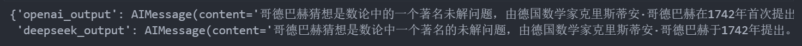
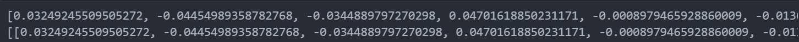

# LangChain v1.0

## LangChain的核心组件

LangChain的核心组件主要涉及四个部分：Model I/O、Chains、RAG、Agents

**Model I/O**:标准化大模型的输入和输出，包含提示模版，模型调用和格式化输出。

**Chains**:“链条”用于将多个组件组合成一个完整的流程，方便链式调用。

**Retrieval**:对应RAG：检索外部数据，作为参考信息输入LLM辅助生成答案。

**Agents**:Agent 自主规划执行步骤并使用工具来完成任务。

## Model I/O

Model I/O 部分是与语言模型进行交互的核心组件，包括输入提示（Prompt Template）、调用模型（Model）、输出解析（Output Parser）。简单来说，就是输入、处理、输出这三个步骤。

### OpenAI SDK调用模型

1、传递prompt，调用client.chat.completions.create

```python
from openai import OpenAI
client = OpenAI(
	base_url="",
	api_key=""
)
res = client.chat.completions.create(model = 'gpt-4o-mini',messages = [{"role":"user","content":"你是谁"}])
```

2、获取模型回复结果

```python
res.choices[0].message.content
```

### API-Key 管理

1、将API_KEY写在代码当中，通过变量去传递

```python
api_key = "sk-*************************"
api_base_url = "https://dashscope.aliyuncs.com/compatible-mode/v1"
from openai import OpenAI
client = OpenAI(
    api_key=api_key,
    base_url=api_base_url
)
client.chat.completions.create(model="qwen-plus",messages=[{"role":"user","content":"你是谁"}])
```

> 正在发送请求… 我是通义千问，由阿里云研发的超大规模语言模型。我能够回答问题、创作文字，比如写故事、写公文、写邮件、写剧本、逻辑推理、编程等等，还能表达观点，玩游戏等。如果你有任何问题或需要帮助，欢迎随时告诉我！

2、将api_key,base_url写到环境变量当中，通过读取环境变量的方式来读取配置

```python
from openai import OpenAI
import os
client = OpenAI(
    api_key=os.getenv("OPENAI_API_KEY"),
    base_url=os.getenv("OPENAI_BASE_URL")
)
res = client.chat.completions.create(model="qwen-plus",messages=[{"role":"user","content":"你是谁"}])
print(res)
```

3、推荐方式：通过配置文件来配置，在代码通过dotenv包加载配置文件

项目根目录创建.env文件

```python
OPENAI_API_KEY="sk-…"
OPENAI_BASE_URL="https://dashscope.aliyuncs.com/compatible-mode/v1"
import dotenv # 可以加载写在.env配置文件当中的环境变量
import os
dotenv.load_dotenv() # 加载
client = OpenAI(
    base_url=os.getenv("OPENAI_BASE_URL"),  # 平台提供的 URL
    api_key=os.getenv("OPENAI_API_KEY"),  # 平台提供的 API Key
)
client.chat.completions.create(model="qwen-plus",messages=[{"role":"user","content":"你是谁"}])
```

### LangChain API 调用模型

#### 通过LangchainAPI调用示例

输入：接受文本 PromptValue 或消息列表 List[BaseMessage]，每条消息需指定角色（如 SystemMessage、HumanMessage、AIMessage）

输出：返回带角色的消息对象（BaseMessage 子类），通常是 AIMessage

```python
import os
import httpx
from langchain.chat_models import init_chat_model
from langchain_core.messages import SystemMessage, HumanMessage
import dotenv

dotenv.load_dotenv()
custom_http_client = httpx.Client(trust_env=False)
model = init_chat_model(
        model="qwen-plus",
        model_provider="openai",
        temperature=0.5,
        base_url=os.getenv("QWEN_BASE_URL"),
        api_key=os.getenv("QWEN_API_KEY"),
        http_client=custom_http_client
    )

messages = [
        SystemMessage(content="你是一个智能助手，可以帮助用户解决问题,你的名字叫做小智"),
        HumanMessage(content="你是谁")
    ]

res = model.invoke(messages)
print("回答内容:", res.content)
```

> 回答内容: 你好呀，我是小智，你的智能小伙伴！我是一个热爱学习、乐于助人的AI助手。无论是解答问题、提供建议，还是陪你聊天、分享有趣的想法，我都很乐意帮忙哦~ 虽然我还在不断学习和成长中，但我会认真对待每一次对话，希望能成为你值得信赖的好伙伴！(•̀ᴗ•́)و

#### init_chat_model相关参数配置

| **参数**        | **说明**                                                     |
| --------------- | ------------------------------------------------------------ |
| **model**       | 模型名称                                                     |
| **base_url**    | 发送请求的 API 端点的 URL。常由模型的提供商提供              |
| **api_key**     | 与模型提供商进行身份验证所需的 API 密钥                      |
| **temperature** | 控制模型输出的随机性。数字越高，回答越有创意；数字越低，回答越确定 |
| **timeout**     | 控制超时时间（以秒为单位）                                   |
| **max_tokens**  | 控制最大输出tokens数量                                       |
| **max_retries** | 请求失败时系统尝试重新发送请求的最大次数                     |

```python
model = init_chat_model(
    model="deepseek-chat",
    model_provider="deepseek",
    max_tokens = 10, # 控制模型总输出长度
    timeout = 0.1, # 由于时间过短，会直接失败，失败后会重试
    max_retries=3
)
# 2、构造一个提示词模板或者提示词
messages = [
    SystemMessage(content="你是一个智能助手，可以帮助用户解决问题,你的名字叫做小智"),
    HumanMessage(content="你是谁")
]
# 3、调用model的Invoke方法，获取模型的结果
model.invoke(messages)
```

#### 构造消息的几种方式

1. 直接使用文本，不使用消息列表

```python
model.invoke("你是谁")
```

1. 通过AIMessage，HumanMessage等类的方式来去构建消息列表

```python
messages = [
    SystemMessage(content="你是一个智能助手，可以帮助用户解决问题,你的名字叫做小智"),
    HumanMessage(content="你是谁")
]
# 调用model的Invoke方法，获取模型的结果
model.invoke(messages)
```

1. 通过字典方式构建消息列表，在字典当中定义角色和具体的消息内容，role:system,human,ai

```python
messages=[
    {"role":"human","content":"你是谁"},
    {"role":"ai","content":"我是小智"},
    {"role":"human","content":"我刚才问你什么问题了"}
]
res =model.invoke(messages)
res.content
```

> ‘你刚才问了“你是谁”。我回答说我是小智。’

### 调用方法

#### 流式调用 、非流式调用

- 非流式输出：当用户发出请求后，系统在后台等待模型生成完整响应，然后一次性将全部结果返回。
- 流式输出：当用户问题刚刚发送，系统就开始一字一句（逐个token）进行回复，更像是“实时对话”，贴近人类交互的习惯。

```python
# 非流式调用 invoke() 调用
from langchain.chat_models import init_chat_model
import dotenv
import os

dotenv.load_dotenv()
# 1、获取大模型的实例
model = init_chat_model(
    model="qwen-plus",
    model_provider="openai",
    temperature = 0.5,
    base_url=os.getenv("QWEN_BASE_URL"),
    api_key=os.getenv("QWEN_API_KEY"),
)
res = model.invoke("你好，你是谁")
print(res)
```

> content=’你好！我是通义千问（Qwen），是阿里巴巴集团旗下的通义实验室研发的超大规模语言模型。我可以帮助你回答问题、创作文字、提供信息查询，还能陪你聊天、写故事、写公文、写邮件、写剧本等等。如果你有任何需要帮助的地方，尽管告诉我哦！😊’ additional_kwargs={‘refusal’: None} response_metadata={‘token_usage’: {‘completion_tokens’: 67, ‘prompt_tokens’: 12, ‘total_tokens’: 79, ‘completion_tokens_details’: None, ‘prompt_tokens_details’: {‘audio_tokens’: None, ‘cached_tokens’: 0}}, ‘model_provider’: ‘openai’, ‘model_name’: ‘qwen-plus’, ‘system_fingerprint’: None, ‘id’: ‘chatcmpl-9db4528a-08fe-9329-b8e9-fe2fe04dd884’, ‘finish_reason’: ‘stop’, ‘logprobs’: None} id=’lc_run–019b8e7a-b3ff-7a73-b027-020a7ad58b7d-0’ usage_metadata={‘input_tokens’: 12, ‘output_tokens’: 67, ‘total_tokens’: 79, ‘input_token_details’: {‘cache_read’: 0}, ‘output_token_details’: {}}

```python
# 流式调用，通过model.stream方法去调用，
# 返回的是一个生成器，通过迭代生成器的方式，得到结果
res = model.stream("你好，你是谁")
for chunk in res:
    print(chunk.content,end="")
```

> 你好！我是通义千问（Qwen），是阿里巴巴集团旗下的通义实验室研发的超大规模语言模型。我可以帮助你回答问题、创作文字、提供信息查询，还能陪你聊天、写故事、写公文、写邮件、写剧本等等。如果你有任何需要帮助的地方，尽管告诉我哦！😊

#### 批量调用、非批量调用

```python
# 批次调用，通过model.batch方法实现，底层原理就是通过多线程的方式去调用，
messages = [
    [
        {"role": "system", "content": "你是一位诗人"},
        {"role": "user", "content": "写一首关于春天的诗"},
    ],
    [
        {"role": "system", "content": "你是一位诗人"},
        {"role": "user", "content": "写一首关于夏天的诗"},
    ],
    [
        {"role": "system", "content": "你是一位诗人"},
        {"role": "user", "content": "写一首关于秋天的诗"},
    ],
]
res = model.batch(messages) # 批量调用,返回一个消息列表
print(res)
```

> [AIMessage(content=’《春信》\n解冻的溪流正把碎银运往下游，\n柳枝在风里试笔，写满河岸的宣纸。\n泥土裂开陶罐的釉，菌丝暗绣青纹，\n蒲公英突然举高融化的钟乳——\n整座荒园开始晃动液态的翡翠。\n\n某个俯身采荠菜的人，\n碰落了草叶上悬垂的晨光。\n她衣襟兜住的蝶影，\n是去年深秋遗落的半阙词牌。\n当云影掠过犁沟，\n大地翻身时抖落的绒毛，\n正轻轻盖住未拆封的暖意。’, additional_kwargs={‘refusal’: None}, response_metadata={‘token_usage’: {‘completion_tokens’: 142, ‘prompt_tokens’: 22, ‘total_tokens’: 164, ‘completion_tokens_details’: None, ‘prompt_tokens_details’: {‘audio_tokens’: None, ‘cached_tokens’: 0}}, ‘model_provider’: ‘openai’, ‘model_name’: ‘qwen-plus’, ‘system_fingerprint’: None, ‘id’: ‘chatcmpl-9978dbce-47fe-92ee-8840-b533e33f348e’, ‘finish_reason’: ‘stop’, ‘logprobs’: None}, id=’lc_run–019bd0c3-58bf-7981-acc5-ef22a7b02d7a-0’, tool_calls=[], invalid_tool_calls=[], usage_metadata={‘input_tokens’: 22, ‘output_tokens’: 142, ‘total_tokens’: 164, ‘input_token_details’: {‘cache_read’: 0}, ‘output_token_details’: {}}), AIMessage(content=’《夏之书》\n蝉蜕卡在年轮的第七道刻痕\n晒烫的柏油路正融化成琥珀\n我数着梧桐叶漏下的光斑\n像在清点碎金\n\n骤雨突然斜切过正午\n晾衣绳上的水珠开始倒流\n老式电扇摇晃着锈蚀的脖颈\n把往事切成薄片\n\n雷声在远处缝补天空的裂口\n紫薇花蜷缩进褪色的旗袍\n当暮色漫过晚风的裙裾\n整座城市浮起幽蓝的潮汐\n\n萤火虫提着灯笼巡游\n寻找被遗忘的星图\n而我的影子正缓缓沉入\n池塘底部发光的淤泥’, additional_kwargs={‘refusal’: None}, response_metadata={‘token_usage’: {‘completion_tokens’: 163, ‘prompt_tokens’: 22, ‘total_tokens’: 185, ‘completion_tokens_details’: None, ‘prompt_tokens_details’: {‘audio_tokens’: None, ‘cached_tokens’: 0}}, ‘model_provider’: ‘openai’, ‘model_name’: ‘qwen-plus’, ‘system_fingerprint’: None, ‘id’: ‘chatcmpl-b78027aa-199a-955e-a868-ab5af2573b9a’, ‘finish_reason’: ‘stop’, ‘logprobs’: None}, id=’lc_run–019bd0c3-58c7-7da0-9517-56b8f69dc4d7-0’, tool_calls=[], invalid_tool_calls=[], usage_metadata={‘input_tokens’: 22, ‘output_tokens’: 163, ‘total_tokens’: 185, ‘input_token_details’: {‘cache_read’: 0}, ‘output_token_details’: {}}), AIMessage(content=’《秋辞》\n银杏把信笺晾在枝头\n风一抖，就碎成满城金箔\n候鸟驮着褪色的云\n在迁徙的途中遗落半枚斜阳\n\n老槐树数着年轮打盹\n蝉蜕卡在第七圈时\n突然想起自己也曾年轻过\n那时露珠总在黎明前走失\n像某些未拆封的诺言\n\n陶罐盛着发酵的黄昏\n葡萄藤在墙隅写潦草诗行\n霜降那夜，所有果实都屏住呼吸\n看月光如何把影子钉在青石阶上\n而落叶是大地寄出的请柬\n邀请我赴一场寂静的葬礼——\n当所有喧响沉入根脉\n泥土里正升起新的韵脚’, additional_kwargs={‘refusal’: None}, response_metadata={‘token_usage’: {‘completion_tokens’: 173, ‘prompt_tokens’: 22, ‘total_tokens’: 195, ‘completion_tokens_details’: None, ‘prompt_tokens_details’: {‘audio_tokens’: None, ‘cached_tokens’: 0}}, ‘model_provider’: ‘openai’, ‘model_name’: ‘qwen-plus’, ‘system_fingerprint’: None, ‘id’: ‘chatcmpl-f3428acc-4163-99f6-8341-0d5df5bcd2ef’, ‘finish_reason’: ‘stop’, ‘logprobs’: None}, id=’lc_run–019bd0c3-58cb-7e91-a9a2-95a7b7e8a30b-0’, tool_calls=[], invalid_tool_calls=[], usage_metadata={‘input_tokens’: 22, ‘output_tokens’: 173, ‘total_tokens’: 195, ‘input_token_details’: {‘cache_read’: 0}, ‘output_token_details’: {}})]

#### 同步调用、异步调用

```python
# 同步调用：多次请求之间串行处理，B请求需要A请求完成之后，再发出请求，得到响应
messagess = [
    [
        {"role": "system", "content": "你是一位诗人"},
        {"role": "user", "content": "写一首关于春天的诗"},
    ],
    [
        {"role": "system", "content": "你是一位诗人"},
        {"role": "user", "content": "写一首关于夏天的诗"},
    ],
    [
        {"role": "system", "content": "你是一位诗人"},
        {"role": "user", "content": "写一首关于秋天的诗"},
    ],
]
import time
start_time = time.time()
res = [model.invoke(messages) for messages in messagess]
end_time = time.time()
print(f"总耗时:{end_time - start_time}")
# 异步调用：model.ainvoke方法，返回一个协程对象，把多个协程对象可以打包成一个协程对象，
# await最终的协程对象，就能够实现异步调用
# 异步调用，能够提高程序的性能。相对于batch调用而言，能够减少资源（线程数）使用量
import asyncio
async def gather_task(messages:list):
    # 调用ainvoke并不会真正地发起请求
    tasks = [model.ainvoke(message_list) for message_list in messages]
    return await asyncio.gather(*tasks)

await gather_task(messagess)
```

### 调用本地大模型

Ollama官方地址：[https://ollama.com](https://ollama.com/)

Ollama Github开源地址：https://github.com/ollama/ollama

```python
from langchain_ollama import ChatOllama

ollama_llm = ChatOllama(
    model="deepseek-r1:7b",
    base_url="http://your-ip:port", # 如果Ollama不在本地默认端口运行，需指定base_url
)
messages = {"role": "user", "content": "你好，请介绍一下你自己"}
resp = ollama_llm.invoke(messages)
print(resp.content)
```

### Prompt Template

模板+变量值=完整的提示词，避免将提示词写死，更加灵活，好维护，适用于大模型应用程序

| 参数              |                                                              |
| ----------------- | ------------------------------------------------------------ |
| template          | 提示模板，包括变量占位符                                     |
| input_variables   | 需要将其值作为提示输入的变量名称列表                         |
| partial_variables | 提示模板携带的部分变量的字典。使用部分变量预先填充模板，无需后续在每次调用时再传递这些变量 |
| **方法**          |                                                              |
| format()          | 使用输入格式化提示                                           |

#### 实例化

方式一：使用构造方法实例化

```python
from langchain_core.prompts import PromptTemplate
template = PromptTemplate(
    template="你是一个翻译助手，帮助用户将{content}翻译成语言：{lang}",
    input_variables=["content","lang"]
)
res =  template.format(content = "什么是LangChain",lang="英语")
print(res)
```

方式二：使用 from_template 方法实例化

```python
template2 = PromptTemplate.from_template(
    template="你是一个翻译助手，帮助用户将{content}翻译成语言：{lang}"
)
res =  template2.format(content = "什么是LangChain",lang="英语")
print(res)
```

> 你是一个翻译助手，帮助用户将什么是LangChain翻译成语言：英语

#### 部分提示模板

方式一：实例化过程中指定 partial_variables 参数

```python
from langchain_core.prompts import PromptTemplate

template = PromptTemplate(
    template="{foo} {bar}",
    input_variables=["foo", "bar"],
    partial_variables={"foo": "hello"},  # 预先定义部分变量
)

prompt = template.format(bar="world")
print(prompt)  # hello world
```

方式二：使用 partial 方法指定默认值

```python
from langchain_core.prompts import PromptTemplate

template = PromptTemplate.from_template("{foo} {bar}")
partial_template = template.partial(foo="hello")  # 预先定义部分变量

prompt = partial_template.format(bar="world")
print(prompt)  # hello world
```

#### 调用方式

除了 format 方法，也可以使用 invoke 方法调用

```python
# a.通过format方式去调用
res =  template.format(content = "什么是LangChain",lang="英语")
print(type(res))

# b. invoke方式去调用
# invoke 方法返回 PromptValue 对象，可以使用 to_string 方法将其转换为字符串
invoke_res = template.invoke({"content":"什么是LangChain","lang":"英语"})
invoke_res.to_string()
```

### ChatPromptTemplate

ChatPromptTemplate是创建聊天消息列表的提示模板。相较于普通 PromptTemplate更适合处理多角色、多轮次的对话场景。

#### 实例化

ChatPromptTemplate 可以通过构造方法或 from_messages 方法来实例化提示词模板。

实例化时需要传入 messages 参数，messages 参数支持如下格式：

> tuple 构成的列表，格式为[(role, content)]
>
> dict 构成的列表，格式为[{“role”:… , “content”:…}]
>
> Message 类构成的列表

```python
# 使用tuple(元组)构成的列表
from langchain_core.prompts import ChatPromptTemplate

template = ChatPromptTemplate.from_messages([
    ("system", "你是一个AI开发工程师，你的名字是{name}。"),
    ("human", "你能帮我做什么?"),
    ("ai", "我能开发很多{thing}。"),
    ("human", "{user_input}"),
])

# 使用 invoke 传入参数
prompt_value = template.invoke({"name": "小谷AI", "thing": "AI", "user_input": "行"})
```

> [SystemMessage(content=’你是一个AI开发工程师，你的名字是小谷AI。’, additional_kwargs={}, response_metadata={}), HumanMessage(content=’你能帮我做什么?’, additional_kwargs={}, response_metadata={}), AIMessage(content=’我能开发很多AI。’, additional_kwargs={}, response_metadata={}, tool_calls=[], invalid_tool_calls=[]), HumanMessage(content=’行’, additional_kwargs={}, response_metadata={})]

```python
# 使用dict构成的列表
from langchain_core.prompts import ChatPromptTemplate
chat_promt_template = ChatPromptTemplate(
    [
        {"role":"system","content":"你是一个{ai_role}，可以帮助用户解决问题"},
        {"role":"human","content":"{user_input}"}
    ]
)
res = chat_promt_template.invoke({"ai_role":"翻译助手","user_input":"将 什么是langchain 翻译成英文"})
res.to_messages()
```

> [SystemMessage(content=’你是一个翻译助手，可以帮助用户解决问题’, additional_kwargs={}, response_metadata={}), HumanMessage(content=’将 什么是langchain 翻译成英文’, additional_kwargs={}, response_metadata={})]

#### 调用方式

推荐使用 from_messages 方法或 invoke 方法调用。

```python
from langchain_core.prompts import ChatPromptTemplate

chat_prompt_template = ChatPromptTemplate.from_messages([
    {"role": "system", "content": "你是一个{ai_role}，可以帮助用户解决问题"},
    {"role": "human", "content": "{user_input}"}
])
res = chat_prompt_template.invoke({"ai_role": "翻译助手", "user_input": "将 什么是langchain 翻译成英文"})
print(res.to_messages())
```

#### 多模态提示词

可以使用提示模板来格式化多模态输入，比如将图片链接作为输入。

```python
from langchain_openai import ChatOpenAI
from langchain_core.prompts import ChatPromptTemplate
import os
import dotenv

dotenv.load_dotenv()
openai_client = ChatOpenAI(
    model="qwen-plus",
    model_provider="openai",
    base_url=os.getenv("QWEN_BASE_URL"),
    api_key=os.getenv("QWEN_API_KEY"),
)
template = ChatPromptTemplate(
    [
        {"role": "system", "content": "用中文简短描述图片内容"},
        {"role": "user", "content": [{"image_url": "{image_url}"}]},
    ]
)


prompt = template.format_messages(
    image_url="https://img2.baidu.com/it/u=2976763563,2523722948&fm=253&app=138&f=JPEG?w=800&h=1200"
)
openai_client.invoke(prompt)
```

> AIMessage(content=’这是一只黑白相间的狗，微笑着朝前看，耳朵直立，表情友好。背景为淡灰色，整体给人一种温暖和愉悦的感觉。’, additional_kwargs={‘refusal’: None}, response_metadata={‘token_usage’: {‘completion_tokens’: 47, ‘prompt_tokens’: 36853, ‘total_tokens’: 36900, ‘completion_tokens_details’: {‘accepted_prediction_tokens’: 0, ‘audio_tokens’: 0, ‘reasoning_tokens’: 0, ‘rejected_prediction_tokens’: 0}, ‘prompt_tokens_details’: {‘audio_tokens’: 0, ‘cached_tokens’: 0}}, ‘model_provider’: ‘openai’, ‘model_name’: ‘gpt-4o-mini-2024-07-18’, ‘system_fingerprint’: ‘fp_efad92c60b’, ‘id’: ‘chatcmpl-CZ5PcXIDV3SqH4rQn8eP0owMxAa8M’, ‘finish_reason’: ‘stop’, ‘logprobs’: None}, id=’lc_run–8e8e8193-a3c0-412f-8c4d-64f9458bfd73-0’, usage_metadata={‘input_tokens’: 36853, ‘output_tokens’: 47, ‘total_tokens’: 36900, ‘input_token_details’: {‘audio’: 0, ‘cache_read’: 0}, ‘output_token_details’: {‘audio’: 0, ‘reasoning’: 0}})

#### 怎么去结合LLM去使用template

```python
from langchain.chat_models import init_chat_model
import dotenv
import os
dotenv.load_dotenv()
model = init_chat_model(
    model="qwen-plus",
    model_provider="openai",
    temperature=0.5,
    base_url=os.getenv("QWEN_BASE_URL"),
    api_key=os.getenv("QWEN_API_KEY"),
)
# 方式一：
# 1、先通过template得到具体的prompt
# 2、将prompt传递给模型的invoke方法去做调用
model.invoke(chat_promt_template.invoke({"ai_role":"翻译助手","user_input":"将 什么是langchain 翻译成英文"}))
model.invoke(template2.invoke({"content":"什么是LangChain","lang":"英语"}).to_string())
# 方式二：通过chain去调用
chain = template2 | model
chain.invoke({"content":"什么是LangChain","lang":"英语"})
```

> AIMessage(content=’What is LangChain?’, additional_kwargs={‘refusal’: None}, response_metadata={‘token_usage’: {‘completion_tokens’: 5, ‘prompt_tokens’: 20, ‘total_tokens’: 25, ‘completion_tokens_details’: None, ‘prompt_tokens_details’: {‘audio_tokens’: None, ‘cached_tokens’: 0}, ‘prompt_cache_hit_tokens’: 0, ‘prompt_cache_miss_tokens’: 20}, ‘model_provider’: ‘deepseek’, ‘model_name’: ‘deepseek-chat’, ‘system_fingerprint’: ‘fp_ffc7281d48_prod0820_fp8_kvcache’, ‘id’: ‘91755f44-50fa-407f-a1e4-106fb6d37a52’, ‘finish_reason’: ‘stop’, ‘logprobs’: None}, id=’lc_run–167d1ef8-491c-4e3e-b248-63a58dc5be7b-0’, usage_metadata={‘input_tokens’: 20, ‘output_tokens’: 5, ‘total_tokens’: 25, ‘input_token_details’: {‘cache_read’: 0}, ‘output_token_details’: {}})

#### template的一些高级特性

1. 部分提示词模板:：适用于提示词模板的层级管理

```python
from langchain_core.prompts import PromptTemplate,ChatPromptTemplate
template = PromptTemplate(
    template="你是一个{ai_role}，帮助用户解决相关问题，用户输入:{user_input}",
    input_variables=["ai_role","user_input"]
)
template
```

> PromptTemplate(input_variables=[‘ai_role’, ‘user_input’], input_types={}, partial_variables={}, template=’你是一个{ai_role}，帮助用户解决相关问题，用户输入:{user_input}’)

```python
translate_partial_template = template.partial(ai_role = "翻译专家")
math_partial_template =template.partial(ai_role= "数学家")
print(math_partial_template)
print(translate_partial_template)
```

> input_variables=[‘user_input’] input_types={} partial_variables={‘ai_role’: ‘数学家’} template=’你是一个{ai_role}，帮助用户解决相关问题，用户输入:{user_input}’
> input_variables=[‘user_input’] input_types={} partial_variables={‘ai_role’: ‘翻译专家’} template=’你是一个{ai_role}，帮助用户解决相关问题，用户输入:{user_input}’

```python
math_partial_template.invoke({"user_input":"什么是微积分"})
translate_partial_template.invoke({"user_input":"翻译什么是langchain"})
```

> StringPromptValue(text=’你是一个翻译专家，帮助用户解决相关问题，用户输入:翻译什么是langchain’)

1. 消息占位符：一般用于Agent当中维护历史对话消息列表

```python
chat_template = ChatPromptTemplate.from_messages(
    [
        ("system","你是一个{ai_role}"),
        ("placeholder","{conversation}"), # 消息占位符
    ]
)
res = chat_template.format(
    ai_role = "智能客服",
    conversation = [
        ("human","你是谁"),
        ("ai","我是一个智能客服")
    ]
)
res
```

> ‘System: 你是一个智能客服\nHuman: 你是谁\nAI: 我是一个智能客服’

#### 从文件当中加载提示词模板

可以从json或者是Yaml当中去进行加载，langchain内部会自动推导文件类型，按照相应的类型去做加载

```python
from langchain_core.prompts import load_prompt
file_template = load_prompt(path=r"./prompt.json", encoding="utf-8")
yaml_file_template = load_prompt(path=r"./prompt2.yaml",encoding="utf-8")
```

### Output Parsers

#### 什么是输出解析器

将大模型的原始自然语言类型的输出，解析成程序所需要的结构化的输出。常用的有 StrOutputParser（字符串解析器）与 JsonOutputParser（JSON解析器）。

```python
from langchain_openai import ChatOpenAI
import dotenv
import os

dotenv.load_dotenv()
openai_llm = ChatOpenAI(
    base_url=os.getenv("QWEN_BASE_URL"),
    api_key=os.getenv("QWEN_API_KEY"),
    model="qwen-plus"
)
openai_llm.invoke("帮我推荐几部诺兰的电影")
```

#### StrOutPutParser

作用：从结果中提取出content字段的内容

```python
# 1、构造实例
from langchain_core.output_parsers import StrOutputParser
str_output_parser = StrOutputParser()
llm_output = openai_llm.invoke("你是谁")

# 当前llm_output 是一个AIMessage的一个实例，在实例当中，封装了大模型的输出结果
# 通过调用str_output_parser.invoke方法，就能够解析获取到大模型输出的content结果
str_output_parser.invoke(llm_output)

# 在链式调用当中，能够一步到位，获取到字符串类型的大模型输出结果
chain = openai_llm | str_output_parser
chain.invoke("你是谁")
```

> ‘我是一个人工智能助手，旨在回答你的问题和提供帮助。有什么我可以为你做的吗？’

#### JsonOutputParser

```python
from langchain_core.output_parsers import JsonOutputParser
from pydantic import BaseModel,Field

# 1.通过pydantic类去定义JSON的结构，并且构造JsonOutputParser的实例
class FilmSuggestion(BaseModel):
    film_name :str = Field(description="电影的名称")
    year: str = Field(description="上映年份")
    descripion :str =Field(description="电影的梗概")
    
film_suggestion = FilmSuggestion(film_name="盗梦空间",year="2025",descripion="一部电影")
print(film_suggestion)
# 输入错误的类型，pydantic的验证机制会触发并报错
# film_suggestion = FilmSuggestion(film_name="盗梦空间",year=2025,descripion="一部电影")

# 2.通过pydantic model，构造一个json的output_parser实例
output_parser = JsonOutputParser(pydantic_object=FilmSuggestion)

# 3.调用output_parser.get_format_instructions()，能够输出让大模型按照指定json形式输出的prompt
format_instructions = output_parser.get_format_instructions()
messages = [
    {"role": "system", "content": format_instructions},
    {
        "role": "user",
        "content": "帮我推荐几部诺兰的电影",
    },
]
# 通过调用output_parser.invoke方法，可以更进一步将大模型输出的字符串解析成字典对象
output_resp = output_parser.invoke(openai_llm.invoke(messages))
print(output_resp)
```

> {‘film_name’: ‘盗梦空间’, ‘year’: ‘2010’, ‘descripion’: ‘一位能够进入他人梦境并植入思想的窃贼，被赋予一项不可能的任务：不是窃取思想，而是将一个想法植入目标的头脑中。’}

### 大模型自身提供的Structured Output

```python
# 1、通过llm对象，调用with_structured_output方法，返回一个新的llm的实例
# 给openai_llm传递一个schema参数即可，参数值为pydantic的类
structured_llm = openai_llm.with_structured_output(schema=FilmSuggestion)

# 新的llm实例，在调用invoke方法，返回的结果，就是一个结构化的对象
structured_llm.invoke("帮我推荐几部诺兰的电影")
```

## Chains

### Runnable

Runnable为langchain底层的接口，langchain中的可运行组件实现了runnable接口，使得langchain当中各个组件拥有统一的调用方式

```python
from langchain_core.prompts import PromptTemplate
from langchain_openai import ChatOpenAI
from langchain_core.output_parsers import StrOutputParser

import dotenv
dotenv.load_dotenv()

prompt_template = PromptTemplate(input_variables=["user_info"],template="{user_info}")
openai = ChatOpenAI()

output_parser = StrOutputParser()

prompt_template.invoke()
openai.invoke()
output_parser.invoke()
```

### LCEL

是langchain中的一种语法,通过 “|” 将langchain 当中的不同组件，组装在一起，构造成一个chain

```python
chain = prompt_template | openai | output_parser

res = chain.invoke({"user_info":"你好，你是谁"})
```

### RunnableSequence

作用：构造一个串行的执行链，通过RunnableSequence的实例，调用invoke方法，就等于链当中每一个组件去调用invoke，然后将调用结果传递给下一个组件

```python
from langchain_core.runnables import RunnableSequence
from langchain_core.prompts import PromptTemplate
from langchain_openai import ChatOpenAI
from langchain_core.output_parsers import StrOutputParser
import os
import dotenv
dotenv.load_dotenv()

prompt_template = PromptTemplate(input_variables=["user_info"],template="{user_info}")
openai = ChatOpenAI(
    base_url=os.getenv("QWEN_BASE_URL"),
    api_key=os.getenv("QWEN_API_KEY"),
    model="qwen-plus"
)
output_parser = StrOutputParser()
# chain = prompt_template | openai | output_parser
# chain.invoke("你好，你是谁")

# 1、实例化
runnable_sequence = RunnableSequence(prompt_template,openai,output_parser)
runnable_sequence.invoke("你好，你是谁")
```

> ‘我是一款人工智能助手，可以回答你的问题和提供帮助。有什么可以帮助你的吗？’

### RunnableParallel

作用：对于同一个输入，能够并行去执行多个组件。

```python
from langchain_core.runnables import RunnableParallel
def func1(a1):
    return a1+"__func1_output"
def func2(a1):
    return a1+"__func2_output"
runnable_parallel = RunnableParallel({"key1":func1,"key2":func2})

runnable_parallel.invoke("你好")
```

> {‘key1’: ‘你好__ func1_output’, ‘key2’: ‘你好__func2_output’}

具体应用：对于用户输入的同一个问题，我们想要调用不同的大模型进行回答，用户可以比对不同大模型回答的效果

```python
from langchain_openai import ChatOpenAI
from langchain_core.prompts import ChatPromptTemplate
from langchain_deepseek import ChatDeepSeek
# 两个模型的实例
openai_model = ChatOpenAI(
    model="gpt-4o-mini"
)
deepseek = ChatDeepSeek(model="deepseek-chat")
messages = [
    ("system","你是一个数学家"),
    ("user","{user_question}")
]
# template的实例
message_template = ChatPromptTemplate.from_messages(messages)
# 结合LCEL和RunnableParallel来去构造一个简单的应用，实现 两个模型之间效果的对比
chain = message_template | RunnableParallel({"openai_output":openai_model,"deepseek_output":deepseek})

chain.invoke({"user_question":"什么是哥德巴赫猜想"})
```



### RunnableLambda

作用：能够传入一个Python的函数，或者说可执行的一个对象，将其封装成Runnable的实例，使得可以通过invoke来进行调用

```python
from langchain_core.runnables import RunnableLambda
# runnable_lambda = RunnableLambda(func1)
runnable_lambda = RunnableLambda(lambda x: x+"__lambda_x")
runnable_lambda.invoke("你好")
```

> ‘你好__lambda_x’

### RunnablePassthrough

1. 作用：可以透传，输入什么，就输出什么
2. 可以为输入，添加额外的键，通过调用RunnablePassthrough.assign()方法指定新的键的执行逻辑

```python
from langchain_core.runnables import RunnablePassthrough
runnable_passthrough = RunnablePassthrough()
runnable_passthrough.invoke({"key":"value"})
```

> {‘key’: ‘value’}

```python
from langchain_core.runnables import RunnablePassthrough
## 通过assign，可以为传递给runnable passthrough的变量，输出添加额外的键

## 注意，此处能够将第一个dict写到chain当中，就是因为Runnable底层，实现了__ror__方法
chain = {
    "text1": lambda x: x + " world",
    "text2": lambda x: x + ", how are you",
} | RunnablePassthrough.assign(word_c5454545ount=lambda x : len(x["text1"]))

result = chain.invoke("hello")
result
```

> {‘text1’: ‘hello world’,
> ‘text2’: ‘hello, how are you’,
> ‘word_c5454545ount’: 11}

### RunnableBranch

1. 作用：其实就是一个if_else操作,能够根据我们所写的判断条件，去具体执行某一个分支的逻辑
2. 构造方式，传入多个分支组成的列表，列表的每一个元素都是一个元组，元组的第一个元素，是一个判断条件，元组的第二个元素，是命中当前判断条件时，所执行的逻辑
3. 当调用invoke方法时，会自上向下去判断，是否符合条件，如果符合条件，就进行执行，如果不符合，会落到最终的“else”分支去执行

```python
from langchain_core.runnables import RunnableBranch
branch = RunnableBranch(
    (lambda x: isinstance(x, str), lambda x: x.upper()),# if x是字符串类型，就执行 x.upper()
    (lambda x: isinstance(x, int), lambda x: x + 1), # elif x是int类型，就执行 x+1 操作
    (lambda x: isinstance(x, float), lambda x: x * 2), # elif x 是float类型，就执行 x*2
    lambda x: "goodbye", # else: 前面的条件都没有命中，就走else 这部分的逻辑
)

branch.invoke(ChatOpenAI)
```

> ‘goodbye’

### RunnableWithFallbacks

作用：在前面的runnable出现异常时，就会执行runnableWithFallbacks

```python
from langchain_openai import ChatOpenAI
import dotenv
dotenv.load_dotenv()
llm = ChatOpenAI()
chain = PromptTemplate.from_template("hello") | llm
# 会报错
chain.invoke("hello")
# 调用方式：通过调用runnable组件的with_fallbacks方法，就可以得到一个RunnableWithFallbacks的一个实例
# with_fallbacks能够接收一个列表，在chain前面报错时，会依次，逐个执行链条当中的runnable组件，如果第一个报错，就执行第二个，以此类推。直到最后一个，如果一直报错，那么就抛出最开始的错误
def func1(x):
    raise Exception(x)
def func2(x):
    raise Exception(x)
chain_with_fallback = chain.with_fallbacks([RunnableLambda(func1)])
type(chain_with_fallback)
chain_with_fallback.invoke("hello")
```

> TypeError: Expected mapping type as input to PromptTemplate. Received <class ‘str’>.

## RAG

典型的RAG有两个主要流程：

 索引：从数据源提取数据，构建索引。

 检索生成：接受用户查询并从索引中检索相关数据，然后将其传递给模型。。

索引阶段：

1. 从各种数据源加载数据
2. 将文档切分为小块
3. 对文本块进行嵌入
4. 存储嵌入向量

检索生成阶段：

1. 根据用户输入，使用检索器从存储中检索相关文本块
2. 大模型使用包含问题和检索结果的提示生成回答

### 文档加载

#### 加载txt文件

```python
from langchain_community.document_loaders import TextLoader
# 1、通过TextLoader创建一个文件加载器
data_loader = TextLoader(
    file_path="assets/sample.txt",
    encoding="utf-8"
)

# 2、调用data_loader.load() 方法，得到真正的文档对象
loaded_documents = data_loader.load()
# 得到的是一个list对象
print(type(loaded_documents))
print(loaded_documents[0].metadata)
print(loaded_documents[0].page_content)
```

> <class ‘list’>
>
> {‘source’: ‘assets/sample.txt’}
> LangChain 是一个用于构建基于大语言模型（LLM）应用的开发框架，旨在帮助开发者更高效地集成、管理和增强大语言模型的能力，构建端到端的应用程序。它提供了一套模块化工具和接口，支持从简单的文本生成到复杂的多步骤推理任务。

```python
# 使用文件方式
with open("assets/sample.txt",mode="r",encoding="utf-8") as file:
    page_content = file.read()

page_content
```

#### 加载CSV文件

```python
from langchain_community.document_loaders import CSVLoader
csv_loader = CSVLoader(
    file_path=r"./assets/sample.csv"
)
res = csv_loader.load()
print(res[0].page_content)
```

> id: 1
> title: Introduction to Python
> content: Python is a popular programming language.
> author: John Doe

```python
# metadata_columns，控制把CSV当中哪一列的数据，也存到Document当中的元数据信息里面
csv_loader = CSVLoader(
    file_path=r"./assets/sample.csv",
    metadata_columns=["title"] #
)
```

#### 加载JSON文件

```python
from langchain_community.document_loaders import JSONLoader
json_loader = JSONLoader(
    file_path="assets/sample.json",
    jq_schema=".",
    text_content=False
)
loaded_json_docs =json_loader.load()
len(loaded_json_docs)
```

> 1

#### 什么是jq_schema

提取json当中对象的一种特定方式，特定的语法。例如：

1. “.” 就是提取整个的json对象，
2. “.data”就是提取json当中的第一个层级的data这个key所对应的内容
3. 如果某一个key对应的是一个列表的话，想要提取这个列表，就需要通过”[]” 去提取，例如json当中data下面的items是一个列表，那么就是.data.items[]。更进一步，想要提取列表当中每一个元素的某一个键，就在后面继续通过.xxx 去提取就可以了

```python
json_loader = JSONLoader(
    file_path="assets/sample.json",
    jq_schema=".data.items[].content",
    text_content=False
)
res = json_loader.load()
res[0].page_content
```

> ‘This article explains how to parse API responses…’

关于text_content参数的作用

```python
json_loader = JSONLoader(
    file_path="./assets/sample.json",
    jq_schema=".status",
    text_content=True
)
json_loader.load()
```

#### 加载HTML网页

```python
import bs4 # beautiful soup
from langchain_community.document_loaders import WebBaseLoader

document_loader = WebBaseLoader(
    # 网址序列
    web_paths=("https://cn.bing.com",),
    # 传给 BeautifulSoup 的解析参数，parse_only 表示只提取指定标签的元素
    # bs_kwargs={"parse_only": bs4.SoupStrainer(class_="J-lemma-content")},
)
print(document_loader)
res = document_loader.load()
res[0].page_content
```

> ‘Search - Microsoft Bing© 2025 Microsoft增值电信业务经营许可证：合字B2-20090007京ICP备10036305号-7京公网安备11010802022657号Privacy and CookiesLegalAdvertiseAbout our adsHelpFeedback’

#### 加载MarkDown文件

总结：MarkDown形式清晰，通过UnstructuredMarkDownLoader，传入mode = elements 可以按照markdown的标准格式去进行加载

```python
from langchain_community.document_loaders import UnstructuredMarkdownLoader
loader = UnstructuredMarkdownLoader(
    file_path="assets/sample.md",
    mode="elements",
) # latex
loader.load()
```

#### 加载Docx文件

```python
from langchain_community.document_loaders import UnstructuredWordDocumentLoader
single_loader = UnstructuredWordDocumentLoader(
    file_path="assets/sample.docx",
    mode="single",
    # model="elements"
)
single_loaded = single_loader.load()
print(single_loaded[0].page_content)
```

#### 加载pdf文件

```python
from langchain_community.document_loaders import UnstructuredPDFLoader

docs = UnstructuredPDFLoader(
    file_path="./assets/sample.pdf",  # 文件路径
    # 加载模式:
    #   single: 返回单个Document对象
    #   elements: 按标题等元素切分文档
    mode="elements",
    # 加载策略:
    #   fast: pdfminer 提取并处理文本
    #   ocr_only: 转换为图片并进行 OCR
    #   hi_res: 识别文档布局 ，将OCR 输出与 pdfminer 输出融合
    strategy="ocr_only",
    # 推断表格结构:仅 hi_res 下起效，如果为 True 则会在表格元素的元数据中添加 text_as_html
    infer_table_structure=True,
    # OCR 使用的语言: eng 英文，chi_sim 中文简体
    languages=["eng", "chi_sim"],
).load()
print(docs)
docs[3]
```

### 文档切分

将完整的 Document 进行分块处理（Chunking），将 Document 切分为一个个小块（Chunk）。无论是在存储还是检索过程中，都将以这些块为基本单位，这样能有效地避免内容噪声干扰和超出最大 Token 的问题。

```python
from langchain_text_splitters import RecursiveCharacterTextSplitter,CharacterTextSplitter
text_splitter = RecursiveCharacterTextSplitter(
    separators=["\n\n","\n","。"],
    chunk_size=400,  # 每个块的最大长度
    chunk_overlap=50,  # 每个块重叠的长度
    length_function=len,  # 可选：计算文本长度的函数，默认为字符串长度，可自定义函数来实现按 token 数切分
    add_start_index=True,  # 可选：块的元数据中添加此块起始索引

)
splitted_res = text_splitter.split_documents(docs)
print(splitted_res)
```

### 文档嵌入

#### 获取嵌入模型：

1. 开源模型：引入HuggingFaceEmbeddings类，传入所使用的模型名称
2. OpenAI闭源嵌入：引入OpenAIEmbeddings类，传入OpenAI的嵌入模型名字。需要注意加载环境变量

```python
import os
import dotenv
dotenv.load_dotenv() 
from langchain_huggingface import HuggingFaceEmbeddings
from langchain_openai import OpenAIEmbeddings
# 加载嵌入模型
embed_model = HuggingFaceEmbeddings(
    model_name=os.path.expanduser("~/models/bge-base-zh-v1.5")
)

# openai_embedding = OpenAIEmbeddings(
#     model="text-embedding-3-small" # 使用的OpenAI的嵌入模型
# )
```

#### 对文档进行嵌入

调用model.embed_documents() 传入由Document所构建的列表

```python
query = "你好，世界" # 模拟对用户的提问进行嵌入
query_res = embed_model.embed_query(query)
# query_res：嵌入的向量，表示的是用户的查询的语义信息
# print(query_res)
print(len(query_res))
# 模拟对文档进行嵌入
docs = ["你好，世界", "你好，世界"]
docs_embedded_result = embed_model.embed_documents(docs)
```

#### langchain对嵌入模型定义了一个抽象类Embeddings（扩展知识）

所以嵌入模型，都可以继承这个类，从而实现了可以调用统一的方法来完成嵌入

```python
query = "你好，世界"
print(openai_embedding.embed_query(query))

# 多文本嵌入
docs = ["你好，世界", "你好，世界"]
print(openai_embedding.embed_documents(docs))
```



### 向量数据库—Milvus

向量数据库就是用来存储向量的数据库。（其他数据库：关系型数据库，列式存储数据库，图数据库，内存数据库等）

> - FAISS：是一个可以用来做向量检索的库（library），并不是一个向量数据库服务，并不会监听端口供客户端去查询其内部的数据
> - Chroma：向量数据库（会监听端口，并接收客户端的连接查询），轻量级的向量数据库。在扩展能力上面较不足。
> - **Milvus**: 向量数据库，生产级别（更加稳定）向量数据库。支持横向扩展。

1、在Milvus构建一个Collection

```python
from pymilvus import MilvusClient
## 获取到客户端对象
client = MilvusClient(
    uri="./mivus_demo.db"
)
```

2、创建 schema

```python
def build_schema():
    schema = MilvusClient.create_schema(auto_id=True)
    schema.add_field(field_name='id', datatype=DataType.INT64,is_primary=True)
    schema.add_field(field_name="vector", datatype=DataType.FLOAT_VECTOR, dim=768) # 存放文本转化后的向量数据
    schema.add_field(field_name="metadata", datatype=DataType.JSON)  # 元数据信息可以用来做检索 （比如文件名、页码、作者）
    schema.add_field(field_name="content", datatype=DataType.VARCHAR, max_length=1024) # 存放原始的文本内容，搜索到向量后，要把这段文字展示给用户看
    return schema
```

3、定义构建索引的逻辑

```python
# 创建索引
def build_index():
    # 得到索引参数
    index_params = MilvusClient.prepare_index_params()
    # 通过调用索引参数的add_index方法，为collection当中定义的字段去构建索引
    index_params.add_index(
        field_name="vector",
        index_type="AUTOINDEX",  # milvus自动根据当前数据量大小选择合适的索引,
        metric_type="COSINE"  # 衡量两个向量之间距离的方式，L2表示的是向量之间的欧式距离, COSINE 余弦相似度
    )
    return index_params
```

4、创建collection

```python
client.create_collection("demo_collection", dimension=768, primary_field_name="id",schema=build_schema(),index_params=build_index())
```

#### 插入实体

```python
import os
from pymilvus import DataType, MilvusClient

## 获取到客户端对象
client = MilvusClient(
  uri="mivus_demo.db" # 连接到 Milvus 数据库。
)

def create_collection():
  # 定义表结构
  def build_schema():
    schema = MilvusClient.create_schema(auto_id=True)
    schema.add_field(field_name='id', datatype=DataType.INT64,is_primary=True)
    schema.add_field(field_name="vector", datatype=DataType.FLOAT_VECTOR, dim=768) # 存放文本转化后的向量数据
    schema.add_field(field_name="metadata", datatype=DataType.JSON)  # 元数据信息可以用来做检索 （比如文件名、页码、作者）
    schema.add_field(field_name="content", datatype=DataType.VARCHAR, max_length=1024) # 存放原始的文本内容，搜索到向量后，要把这段文字展示给用户看
    return schema
  
  # 创建索引
  def build_index():
    # 得到索引参数
    index_params = MilvusClient.prepare_index_params()
    # 通过调用索引参数的add_index方法，为collection当中定义的字段去构建索引
    index_params.add_index(
        field_name="vector",
        index_type="AUTOINDEX",  # milvus自动根据当前数据量大小选择合适的索引,
        metric_type="COSINE"  # 衡量两个向量之间距离的方式，L2表示的是向量之间的欧式距离, COSINE 余弦相似度
    )
    return index_params
  
  client.create_collection("demo_collection", dimension=768, primary_field_name="id",schema=build_schema(),index_params=build_index())

# 读取文档
def get_document():
  """
  准备Document，将Document交给embedding model 来进行嵌入
  """
  from langchain_community.document_loaders import UnstructuredWordDocumentLoader
  data_loader = UnstructuredWordDocumentLoader(
      file_path="./assets/sample.docx",
      mode="elements"
  )
  return data_loader.load()

# 文本转向量
def get_embeddings(document_list):
    """
    通过嵌入模型来得到向量
    """
    from langchain_huggingface import HuggingFaceEmbeddings
    model = HuggingFaceEmbeddings(
        model_name="BAAI/bge-base-zh-v1.5",
    )
    return model.embed_documents(document_list)

# 往集合当中插入数据
def get_data_to_insert_into_milvus():
  documents = get_document()
  print("documents", documents)
  document_embeddings = get_embeddings([document.page_content for document in documents])
  list_dict = [
    {
      "vector": document_embedding,
      "metadata":document.metadata,
      "content": document.page_content,
    }
    for document,document_embedding in zip(documents,document_embeddings)
  ]
  return list_dict

if not client.has_collection("demo_collection"):
  create_collection()
  print("集合创建成功！")

datas =  get_data_to_insert_into_milvus()
client.insert(collection_name="demo_collection", data = datas)
print(f"成功插入 {len(datas)} 条数据！")
```

#### 检索与生成

```python
import os

from langchain_core.prompts import ChatPromptTemplate
from pymilvus import DataType, MilvusClient

client = MilvusClient(uri="mivus_demo.db")

def query() -> list[dict]:
    res = client.query(
        collection_name="demo_collection",
        filter='metadata["source"] == "./assets/sample.docx"',  # 根据collection当中定义的其他字段信息（非向量字段）进行筛选
        output_fields=["content"],
        limit=1,
    )
    return res


# res = query()
# print(res)


def query_vector(user_query):
    from langchain_huggingface import HuggingFaceEmbeddings

    embed_model = HuggingFaceEmbeddings(model_name="BAAI/bge-base-zh-v1.5")
    query_embedding = embed_model.embed_query(user_query)  # 查询嵌入
    context = client.search(
        collection_name="demo_collection",  # collection 名称
        data=[query_embedding],  # 搜索的向量
        anns_field="vector",  # 进行向量搜索的字段
        # 度量方式：L2 欧氏距离/IP 内积/COSINE 余弦相似度
        search_params={"metric_type": "COSINE"},
        output_fields=[
            "content",
        ],  # 输出字段
        limit=3,  # 搜索结果数量
    )
    real_results = context[0]
    # print(real_results)
    content_list = [real_result["entity"]["content"] for real_result in real_results]
    return content_list


# res = query_vector("不动产被占有了怎么办?")
# print(res)


def get_llm_chain():
    """
    获取到一个llm执行链，这个执行链，能够基于文档内容去做应答
    :return:
    """
    from langchain_openai import ChatOpenAI
    import dotenv

    dotenv.load_dotenv()
    llm = ChatOpenAI(
        model="qwen-plus",
        base_url=os.getenv("QWEN_BASE_URL"),
        api_key=os.getenv("QWEN_API_KEY"),
    )
    chat_template = ChatPromptTemplate.from_messages(
        [
            {
                "role": "system",
                "content": "请你基于以下上下文信息，回答用户相关的问题。不可以回答上下文当中不存在的信息，如果不存在，直接说不知道。上下文信息如下：\n\n {context}",
            },
            {"role": "user", "content": "{user_question}"},
        ]
    )
    chain = chat_template | llm
    return chain


user_input = "不动产被占有了怎么办?"
context_result = query_vector(user_input)

chain = get_llm_chain()
llm_result = chain.invoke(
    {"user_question": "不动产被占有了怎么办?", "context": context_result}
)
print(llm_result)
```

## Agent

Agent 是一种使用 LLM 作为推理引擎的系统，它决定要采取哪些行动以及这些行动的输入应该是什么。这些行动的结果可以反馈给 Agent，由 Agent 决定是否需要采取更多行动，或者是否可以完成。与传统的固定流程链不同，Agent 具备一定的自主决策能力，更适合处理开放式、多步骤的问题。它可以拆解任务，根据任务动态决定调用哪些工具，并利用中间结果推进任务。

### Tools

工具封装了一个可调用函数及其输入模式。这些参数可以传递给兼容的聊天模型，从而允许模型决定是否调用工具以及调用哪些参数。在这种情况下，工具调用使模型能够生成符合指定输入模式的请求。

#### 如何去构建一个tools

```python
from langchain_core.tools import tool


## 方式1：通过装饰器的方式去定义。在函数的前面上面添加@tool装饰器
@tool
def calculate_expo(base: int, expo: int):
    """
    一个用于计算幂的函数
    :param base:
    :param expo:
    :return:
    """
    return base**expo

print(calculate_expo.name)
print(calculate_expo.description)
print(calculate_expo.args)
```

> calculate_expo
> 一个用于计算幂的函数
> :param base:
> :param expo:
> :return:
> {‘base’: {‘title’: ‘Base’, ‘type’: ‘integer’}, ‘expo’: {‘title’: ‘Expo’, ‘type’: ‘integer’}}

```python
# 方式2：通过调用tool函数去定义

def calculate_expo2(base: int, expo: int):
    """
    一个用于计算幂的函数
    :param base:
    :param expo:
    :return:
    """
    return base**expo


calculate_expo2 = tool(calculate_expo2)

# 定义函数入参结构时，除了使用typed hint(也就是base:int这种类型推断)外，我们还可以使用我们的pydantic
from pydantic import BaseModel,Field
def calculate_expo3(base,expo):
    return base**expo
class CalcExpoSchema(BaseModel):
    base:int = Field(description="幂的底数")
    expo:int = Field(description="幂的指数")
calculate_expo3 = tool(calculate_expo3,args_schema=CalcExpoSchema,description="一个用于计算幂的函数")
calculate_expo3.args

# print(type(calculate_expo2))
# print(type(a_new_tool))
args = {"base": 2, "expo": 3}
globals()["calculate_expo2"].invoke(args)
```

> 8

#### 如何去调用tool

通过调用invoke去执行tool当中的逻辑，invoke传入一个dict，dict的键就是tool的入参，值就是参数的值

```python
calculate_expo3.invoke({"base": "2", "expo": 3})
```

#### 绑定tool

```python
from langchain_openai import ChatOpenAI
import os
import dotenv
dotenv.load_dotenv()
llm = ChatOpenAI(
    model="qwen-plus",
    base_url=os.getenv("QWEN_BASE_URL"),
    api_key=os.getenv("QWEN_API_KEY"),
)
tools = [calculate_expo3]
llm_with_tools_bound = llm.bind_tools(tools)
res = llm_with_tools_bound.invoke("帮我计算一下2的10次方是多少")
print(res)
```

> AIMessage(content=’’, additional_kwargs={‘refusal’: None}, response_metadata={‘token_usage’: {‘completion_tokens’: 28, ‘prompt_tokens’: 187, ‘total_tokens’: 215, ‘completion_tokens_details’: None, ‘prompt_tokens_details’: {‘audio_tokens’: None, ‘cached_tokens’: 0}}, ‘model_provider’: ‘openai’, ‘model_name’: ‘qwen-plus’, ‘system_fingerprint’: None, ‘id’: ‘chatcmpl-42b70342-f7aa-9400-b117-073c1c6d16f0’, ‘finish_reason’: ‘tool_calls’, ‘logprobs’: None}, id=’lc_run–019ba888-6eb0-7f91-85b8-a892a5cf34bf-0’, tool_calls=[{‘name’: ‘calculate_expo3’, ‘args’: {‘base’: 2, ‘expo’: 10}, ‘id’: ‘call_a8287c2874394f5f840736’, ‘type’: ‘tool_call’}], invalid_tool_calls=[], usage_metadata={‘input_tokens’: 187, ‘output_tokens’: 28, ‘total_tokens’: 215, ‘input_token_details’: {‘cache_read’: 0}, ‘output_token_details’: {}})

```python
# 手动执行工具
for tool_call in res.tool_calls:
    print(tool_call)
    tool_name = tool_call["name"] # 获取工具名称
    args = tool_call["args"] # 获取工具参数
    tool_invoke_res = globals()[tool_name].invoke(args) # 执行工具
    print(tool_invoke_res)
```

> {‘name’: ‘calculate_expo3’, ‘args’: {‘base’: 2, ‘expo’: 10}, ‘id’: ‘call_a8287c2874394f5f840736’, ‘type’: ‘tool_call’}
> 1024

### 构建Agent

#### 如何创建agent

通过调用langchain.agents.create_agent来构建一个agent，传入agent所能使用工具，以及agent的大脑：LLM

```python
from langchain.agents import create_agent
from langchain_openai import ChatOpenAI
from langchain_tavily import TavilySearch
import os
import dotenv
dotenv.load_dotenv()

llm = ChatOpenAI(
    model="qwen-plus",
    base_url=os.getenv("QWEN_BASE_URL"),
    api_key=os.getenv("QWEN_API_KEY"),
)
# 定义 Tavily 搜索工具
tavily_search_tool = TavilySearch(max_results=5)  # 返回的搜索结果的最大数量
tools = [tavily_search_tool]
agent = create_agent(
    model=llm,
    tools=tools,
    system_prompt="你是一个智能助手，能够选择合适的工具帮助用户解决问题",
)
llm.invoke("你好")
```

> AIMessage(content=’你好呀！✨ 很高兴见到你！今天过得怎么样呀？希望你度过了愉快的一天。我随时准备好陪你聊天、帮你解决问题，或者就这样轻松愉快地闲聊一会儿。有什么想跟我分享的吗？ 🌟’, additional_kwargs={‘refusal’: None}, response_metadata={‘token_usage’: {‘completion_tokens’: 51, ‘prompt_tokens’: 9, ‘total_tokens’: 60, ‘completion_tokens_details’: None, ‘prompt_tokens_details’: {‘audio_tokens’: None, ‘cached_tokens’: 0}}, ‘model_provider’: ‘openai’, ‘model_name’: ‘qwen-plus’, ‘system_fingerprint’: None, ‘id’: ‘chatcmpl-3e961636-0c79-9859-b7ae-2823c543955f’, ‘finish_reason’: ‘stop’, ‘logprobs’: None}, id=’lc_run–019bad5e-4f07-7a82-aaa4-3d89f2b6a2c5-0’, tool_calls=[], invalid_tool_calls=[], usage_metadata={‘input_tokens’: 9, ‘output_tokens’: 51, ‘total_tokens’: 60, ‘input_token_details’: {‘cache_read’: 0}, ‘output_token_details’: {}})

#### 使用Agent

```python
# 不能直接使用字符串来invoke，会报错，
agent.invoke("帮我查看下北京的天气怎么样")

# 调用需要通过messages key和消息列表作为value来调用
res = agent.invoke(
    {"messages": [{"role": "user", "content": "帮我看下北京天气怎么样"}]}
)
for message in res["messages"]:
    print(message.__class__, message, end="\n\n\n\n")
res["messages"][-1]
```

> AIMessage(content=’根据最新的天气信息，北京近期的天气情况如下：\n\n- **当前天气趋势**：北京近期以晴朗和干燥为主，部分地区有大风或沙尘预警。例如，曾发布过大风蓝色预警和沙尘暴蓝色预警，提醒内蒙古、山西、京津冀等地区可能出现7级风，阵风可达8至9级，并伴有扬沙或浮尘。\n \n- **气温范围**：近期白天最高气温在8°C左右，夜间最低气温可降至-6°C左右，昼夜温差较大。\n\n- **未来几天展望**：\n - 北京整体雨雪稀少，天气较为稳定。\n - 受冷空气影响，东北地区降雪增强，但北京主要表现为风力较大和空气干燥。\n - 中东部地区气温有震荡回升的趋势，但冷空气活动仍较频繁。\n\n建议关注实时天气预报，注意防风保暖，特别是在早晚时段温差大的情况下适当增减衣物。如果空气质量下降（如出现沙尘），敏感人群应减少户外活动。\n\n如需更精确的实时天气数据（如每小时更新、空气质量指数AQI等），可以访问[中国气象局官网](https://weather.cma.cn/web/weather/54511.html) 或 [中央气象台](https://www.weather.com.cn/) 查询。’, additional_kwargs={‘refusal’: None}, response_metadata={‘token_usage’: {‘completion_tokens’: 275, ‘prompt_tokens’: 5240, ‘total_tokens’: 5515, ‘completion_tokens_details’: None, ‘prompt_tokens_details’: {‘audio_tokens’: None, ‘cached_tokens’: 0}}, ‘model_provider’: ‘openai’, ‘model_name’: ‘qwen-plus’, ‘system_fingerprint’: None, ‘id’: ‘chatcmpl-2b826802-ca4d-9887-b825-f881c5a36a67’, ‘finish_reason’: ‘stop’, ‘logprobs’: None}, id=’lc_run–019bad61-b591-7581-9328-10e1cdfb11dc-0’, tool_calls=[], invalid_tool_calls=[], usage_metadata={‘input_tokens’: 5240, ‘output_tokens’: 275, ‘total_tokens’: 5515, ‘input_token_details’: {‘cache_read’: 0}, ‘output_token_details’: {}})

### 使用langsmith来追踪调用链

使用 LangChain 构建的许多应用程序都包含多个步骤，需要多次调用 LLM。随着这些应用程序变得越来越复杂，能够检查链或 Agent 内部的具体情况变得至关重要。最好的方法是使用 LangSmith。

1、使用方式：在langsmith申请api_key，构造以下环境变量：

> LANGSMITH_TRACING=true
>
> LANGSMITH_API_KEY=…
>
> LANGSMITH_ENDPOINT=[https://api.smith.langchain.com](https://api.smith.langchain.com/)
>
> LANGSMITH_PROJECT=agent_proj。构造好后，load环境变量，之后langchain底层就可以自动将每次调用记录到langsmith当中了

2、如何在agent当中引入记忆

> - 在创建agent时，传入checkpointer参数，在测试环境下，可以传入InMemorySaver()，生产环境下，使用数据来保存记忆。
> - 在invoke时，需要指定，将记忆保存到哪个“会话”当中，指定方式，传入config参数：{“configurable”:{“thread_id”:1}},thread_id真正指定了，将记忆存入哪个“会话当中”

```python
from langgraph.checkpoint.memory import InMemorySaver

agent_with_memory = create_agent(
    model=llm,
    tools=tools,
    system_prompt="你是一个智能助手，能够选择合适的工具帮助用户解决问题",
    checkpointer=InMemorySaver(),
)
agent_with_memory.invoke(
    {"messages": [{"role": "user", "content": "我刚才问你什么了"}]},
    config={"configurable": {"thread_id": 1}},
)["messages"][-1]
```

> AIMessage(content=’你刚才问我“帮我看下北京天气怎么样”。我已根据最新的信息为你提供了北京的天气情况，包括温度、天气状况和相关预警提示。’, additional_kwargs={‘refusal’: None}, response_metadata={‘token_usage’: {‘completion_tokens’: 33, ‘prompt_tokens’: 3419, ‘total_tokens’: 3452, ‘completion_tokens_details’: None, ‘prompt_tokens_details’: {‘audio_tokens’: None, ‘cached_tokens’: 0}}, ‘model_provider’: ‘openai’, ‘model_name’: ‘qwen-plus’, ‘system_fingerprint’: None, ‘id’: ‘chatcmpl-581e1509-ab06-9728-b6f8-5e44ca982276’, ‘finish_reason’: ‘stop’, ‘logprobs’: None}, id=’lc_run–019bad94-68ed-73c1-92c7-6af6828aae42-0’, tool_calls=[], invalid_tool_calls=[], usage_metadata={‘input_tokens’: 3419, ‘output_tokens’: 33, ‘total_tokens’: 3452, ‘input_token_details’: {‘cache_read’: 0}, ‘output_token_details’: {}})

## MCP

Model Context Protocol（MCP，模型上下文协议）是一个开源协议，它标准化了大语言模型与外部工具和数据源通信的方式，允许开发者和工具提供商只需集成一次，就能与任何兼容 MCP 的系统交互。

### MCP架构

MCP 遵循客户端-服务器架构

| MCP 主机   | 协调和管理一个或多个 MCP 客户端的 AI 应用                    |
| ---------- | ------------------------------------------------------------ |
| MCP 客户端 | 一个保持与 MCP 服务器连接的组件，通过 MCP 定义的消息处理通信，从服务器查找并请求资源和工具，并管理与服务器的连接生命周期 |
| MCP 服务器 | 一个向 MCP 客户端提供服务的程序，通过协议暴露工具、资源和提示模板功能 |

### Stdio 服务端与客户端

```python
# 客户端
import asyncio
from mcp.client.stdio import stdio_client
from mcp import ClientSession, StdioServerParameters

async def stdio_run():
    # 子进程
    # stdio的客户端和服务端是同一台机器当中的两个进程
    server_params = StdioServerParameters(
        command=r"/usr/bin/python3",
        args=[r"./17-mcp_stdio_server.py"],
    )

    async with stdio_client(server_params) as (
        read,
        write,
    ):  # read write 就是标准输入，输出，也就是说为 stdio
        async with ClientSession(read, write) as session:
            # 初始化连接
            await session.initialize()

            # 获取可用工具
            tools = await session.list_tools()
            print(tools)
            print()

            # 调用工具
            call_res = await session.call_tool("add_two_number", {"a": 1, "b": 2})
            print(call_res)
            print()
            
asyncio.run(stdio_run())
# 服务端
from mcp.server.fastmcp import FastMCP

fast_mcp_instance = FastMCP(name="demo_mcp")

@fast_mcp_instance.tool()
def add_two_number(a: int, b: int):
    return a + b

if __name__ == "__main__":
    fast_mcp_instance.run(transport="stdio")
```

### Streamable HTTP 服务端与客户端

```python
# 客户端
import asyncio
from mcp import ClientSession
from mcp.client.streamable_http import streamablehttp_client

async def streamablehttp_run():
    url = "http://127.0.0.1:8000/mcp"  # /mcp路径是一个固定的路径
    # headers = {"Authorization": "Bearer sk-atguigu"}

    async with streamablehttp_client(
        url,
    ) as (read, write, _):
        async with ClientSession(read, write) as session:
            # 初始化连接

            # 得到session之后，和stdio的方式是一样的
            await session.initialize()

            tools = await session.list_tools()
            print(tools)
            print()

            # 调用工具
            call_res = await session.call_tool("add", {"a": 1, "b": 2})
            print(call_res)
            print()

asyncio.run(streamablehttp_run())
# 服务端
from mcp.server.fastmcp import FastMCP

# 创建 MCP 实例
mcp = FastMCP("Demo")

# 为 MCP 实例添加工具
@mcp.tool()
def add(a: int, b: int) -> int:
    return a + b

@mcp.tool()
def multiply(a: int, b: int) -> int:
    return a * b

if __name__ == "__main__":
    # transport参数，传值为streamable-http
    mcp.settings.host = "0.0.0.0"
    mcp.run(transport="streamable-http")
```

### 将多个 Streamable HTTP 服务器挂载到 ASGI 服务器

```python
import uvicorn
import contextlib
from fastapi import FastAPI
from mcp.server.fastmcp import FastMCP

# 创建 MCP 实例
tool_mcp = FastMCP("tool server")
resource_mcp = FastMCP("resource server")
prompt_mcp = FastMCP("prompt server")


# 为 tool_mcp 实例添加工具
@tool_mcp.tool()
def add(a: int, b: int) -> int:
    return a + b


# 为 resource_mcp 实例添加资源
@resource_mcp.resource("greeting://default")
def get_greeting() -> str:
    return "Hello from static resource!"


# 为 prompt_mcp 实例添加提示词
@prompt_mcp.prompt()
def greet_user(name: str, style: str = "friendly") -> str:
    styles = {
        "friendly": "写一句友善的问候",
        "formal": "写一句正式的问候",
        "casual": "写一句轻松的问候",
    }
    return f"为{name}{styles.get(style, styles['friendly'])}"


# 设置 MCP 的 HTTP 根路径
tool_mcp.settings.streamable_http_path = "/"
resource_mcp.settings.streamable_http_path = "/"
prompt_mcp.settings.streamable_http_path = "/"


# 创建一个组合生命周期来管理会话管理器
@contextlib.asynccontextmanager
async def lifespan(app: FastAPI):
    async with contextlib.AsyncExitStack() as stack:
        await stack.enter_async_context(tool_mcp.session_manager.run())
        await stack.enter_async_context(resource_mcp.session_manager.run())
        await stack.enter_async_context(prompt_mcp.session_manager.run())
        yield


app = FastAPI(lifespan=lifespan)

# 挂载 MCP 服务器
app.mount("/tool", tool_mcp.streamable_http_app())
app.mount("/resource", resource_mcp.streamable_http_app())
app.mount("/prompt", prompt_mcp.streamable_http_app())

if __name__ == "__main__":
    uvicorn.run(app)
```

### LangChain使用MCP

```python
import os
import asyncio
from urllib.parse import urlencode
from langchain.agents import create_agent
from langchain.chat_models import init_chat_model
from langchain_mcp_adapters.client import MultiServerMCPClient
import dotenv
dotenv.load_dotenv()
# 配置 MCP 客户端
mcp_client = MultiServerMCPClient(
    {
        "WebSearch": {
            "transport": "sse",
            "url": "https://dashscope.aliyuncs.com/api/v1/mcps/WebSearch/sse",
            "headers": {"Authorization": f"Bearer {os.getenv('DASHSCOPE_API_KEY')}"},
        },
        "RailService": {
            "transport": "streamable_http",
            "url": f"{'https://server.smithery.ai/@DeniseLewis200081/rail/mcp'}?{urlencode({'api_key': os.getenv('SMITHERY_API_KEY')})}",
        },
    }
)
# mcp_client.get_tools() 获取到的是一个协程对象，所以需要通过asynio.run的方式执行协程，获取工具
tools = asyncio.run(mcp_client.get_tools())

# 定义模型
llm = init_chat_model(
    model="gpt-4o-mini",
    model_provider="openai",
    # base_url="https://openrouter.ai/api/v1",
    # api_key=os.getenv("OPENROUTER_API_KEY"),
)

# 创建 Agent
agent = create_agent(model=llm, tools=tools)

# 调用 Agent
async def main():
    async for chunk in agent.astream( # 异步流式的方式调用
        {
            "messages": [
                {"role": "system", "content": "你是位助手，需要调用工具来帮助用户。"},
                {
                    "role": "user",
                    "content": "北京今天天气怎么样，要是还不错的话，帮我看看今天上海到北京的车票",
                },
            ]
        }
    ):
        print(chunk, end="\n\n")

asyncio.run(main())
```
