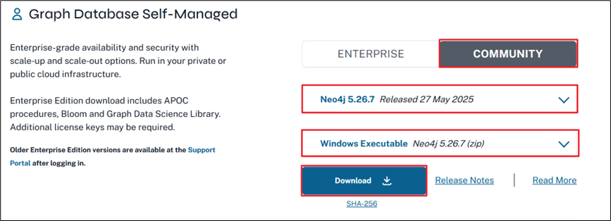
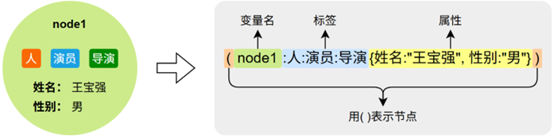
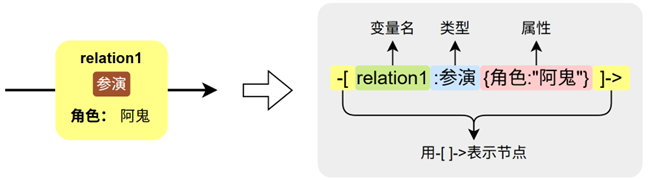

# Neo4j学习

## 简介

图数据库（Graph Database）是一种以图结构为基础进行数据存储与查询的数据库。与传统的关系型数据库通过表格和主外键进行建模不同，图数据库使用节点（Nodes）和关系（Relationships）直接表示实体及其之间的连接，更加自然地映射现实世界中的关联结构，特别适用于处理复杂的连接型数据。

## 安装

### 安装方式概览

**Neo4j Desktop**

本地可视化工具，适合开发者使用，界面友好，支持多项目管理，适用于学习、测试和原型开发。

**OS Deployment**

通过系统安装包部署，适用于生产环境，具备更高的灵活性和控制力，适合有一定技术基础的用户。

**Neo4j Aura**

官方提供的全托管云数据库服务，免安装、免运维，开箱即用，适合快速上线项目或对云优先策略有需求的用户。

### 安装JDK

Neo4j的运行需要Java环境，根据[官方文档](https://neo4j.com/docs/operations-manual/5/installation/requirements/#deployment-requirements-java)要求，5.26（LTS）版本的Neo4j需要安装JDK17或者JDK21。

### 安装Neo4j

#### 获取安装包

安装包可从[Neo4j官网](https://neo4j.com/deployment-center/)下载



#### 配置环境变量

安装包获取后，须手动解压到安装目录，并添加环境变量 `NEO4J_HOME`，路径指向 bin 的上一级路径，然后再在 PATH环境变量下添加`%NEO4J_HOME%\bin`。操作完成后可在终端执行`neo4j --version` 命令，如果输出版本信息，则说明操作成功。

#### 安装Neo4j service

执行如下命令，可将eno4j作为系统服务进行安装。

```sql
neo4j windows-service install
```

#### 启动Neo4j

初次启动，需执行如下命令，后续会开机自启。

```sql
neo4j start
```

#### 访问web页面

启动成功后，neo4j会提供一个web页面作为客户端，访问地址为http://localhost:7474/browser/preview/ ，初始用户名和密码均为neo4j。初次登录需要修改密码。


## Cypher语言基础

Cypher 基于 Neo4j 的图数据模型进行设计，该模型由以下三种基本元素组成：

**节点（Node）**

节点代表图中的实体对象，如“人”、“公司”、“电影”等。每个节点：

- 拥有一个或多个标签（Labels）（可选）
- 包含若干属性（Properties）（可选）

Cypher中用 **( )** 声明一个节点，具体语法如下图所示：



**关系（Relationship)**

关系用于连接两个节点，表示它们之间的有向连接，如“人导演电影”，“人参演电影”，每个关系：

- 拥有一个类型（Type）（必须）
- 包含若干个属性（Propertie）（可选）

Cypher中用 -[ ]-> 声明一个关系，具体语法如下图所示：



**路径（Path）**

路径是由一系列**节点和关系连接构成的结构**，代表图中实体间的关联链条，是图查询的核心。

### 写入节点

使用 CREATE 语句创建图中的节点。每个节点可以携带一个或多个标签（如 Person、Actor）和一组属性（如 name、gender），这些标签和属性用来标识节点的类型和具体信息。

```sql
CREATE (n1:Person:Actor:Director {name: '王宝强', gender: '男'})
CREATE (n2:Movie {title: '唐探1900', released: '2025-01-29'})
```

### 查询节点

使用 MATCH 语句可以查找图中的节点。但实际上，MATCH 的作用不仅仅是“查询节点”，它的本质是匹配图中符合特定结构（Pattern）的数据。

**查询所有节点**

```sql
MATCH (n)
RETURN n
```

**按标签筛选特定的节点**

```sql
MATCH(n:Person)
RETURN n
```

**按标签和属性筛选特定的节点**

```sql
MATCH (n:Person {name: '王宝强'})
RETURN n;
```

### 写入关系

通过 CREATE 语句也可以在两个节点之间创建关系。关系必须指定类型，也可以带上属性（例如角色名），用来表示两个实体之间的具体连接方式。

```sql
MATCH (n1:Person {name: '王宝强'}), (n2:Movie {title: '唐探1900'})
CREATE (n1)-[:ACTED_IN {role: '阿鬼'}]->(n2)
```

### 查询关系

关系模式通常包括起始节点、关系方向和类型、以及目标节点。

```sql
MATCH (n1:Person {name: '王宝强'})-[r]->(n2:Movie {title: '唐探1900'})
RETURN r
```

### 写入路径

路径结构由节点 ( ) 和关系 -[ ]-> 组合而成

```sql
CREATE
  (n1:Person:Actor:Singer {name: '刘德华', gender: '男'})-
    [:ACTED_IN {roles: ['刘建明']}]->
  (n2:Movie {title: '无间道', released: '2002-12-12'})
```

### 修改数据

可以使用 SET 和 REMOVE 对图中的节点或关系进行修改。SET 用于添加或更新属性，也可以为节点添加新的标签；REMOVE 用于删除属性或移除已有的标签。

**为节点添加属性和标签**

```sql
MATCH (n1:Person {name: '王宝强'})
SET n1.birth = '1984-05-29', n1: Singer
```

**为关系删除和添加属性**

```sql
MATCH (n1:Person {name: '王宝强'})-[r:ACTED_IN]->(n2:Movie {title: '唐探1900'})
REMOVE r.role
SET r.roles = ['阿鬼']
```

### 删除数据

使用 DELETE 可以删除节点和关系。在执行删除操作前，通常需要先通过 MATCH 找到对应的节点和关系。如果一个节点还有未删除的关系，必须先删除关系，才能成功删除该节点

```sql
MATCH (n1:Person {name: '王宝强'})-[r:ACTED_IN]->(n2:Movie {title: '唐探1900'})
DELETE n1, r, n2
```

### 合并操作

Merge（合并）操作相当于Match和Create操作的一个组合，其会先匹配目标节点或关系是否存在，如果不存在，则创建目标节点，如果存在则不执行任何操作。

**Merge节点**

```sql
// Merge电影节点
MERGE (n2:Movie {title: '唐探1900', released: '2025-01-29'});

// Merge演员节点
MERGE (n1:Person:Actor:Director {name: '王宝强', gender: '男'})
  ON CREATE SET n1.create_time = datetime() // 创建时设置创建时间（可选操作）
  ON MATCH SET n1.update_time = datetime() // 匹配时设置更新时间（可选操作）
```

**Merge关系**

```sql
// Merge关系
MERGE (n1:Person {name: '王宝强'})-[r:ACTED_IN {roles: ['阿鬼']}]->(n2:Movie {title: '唐探1900'})
```

## 数据类型

Cypher 中的值可以作为节点或关系的属性，也可用于查询条件、函数参数或返回结果。

### 基本数据类型

| **类型**    | **示例**          | **说明**                      |
| ----------- | ----------------- | ----------------------------- |
| **String**  | ‘Neo4j’, ‘王宝强’ | 字符串，必须用单/双引号括起来 |
| **Integer** | 42, 2025          | 整数类型                      |
| **Float**   | 3.14, 99.99       | 浮点类型，带小数点            |
| **Boolean** | true, false       | 布尔值                        |

### 复合数据类型

| **类型** | **示例**                       | **说明**                             |
| -------- | ------------------------------ | ------------------------------------ |
| **List** | [‘王宝强’, ‘刘昊然’]           | 有序列表，可存储多个值               |
| **Map**  | {year: 2025, month: 6, day: 1} | 键值对形式的结构，常用于函数参数传递 |

## Cypher函数

### 字符串函数

用于对字符串进行格式化、截取、替换等常见操作，便于对文本属性进行处理和筛选。

| **函数**             | **示例**                                    | **说明**     |
| -------------------- | ------------------------------------------- | ------------ |
| **toUpper()**        | RETURN toUpper(‘neo4j’) → ‘NEO4J’           | 转为大写     |
| **toLower()**        | RETURN toLower(‘NEO4J’) → ‘neo4j’           | 转为小写     |
| **substring()**      | RETURN substring(‘neo4j’, 0, 3) → ‘neo’     | 截取子串     |
| **replace()**        | RETURN replace(‘neo4j’, ‘o’, ‘O’) → ‘neO4j’ | 替换字符串   |
| **trim()**           | RETURN trim(‘ hello ‘) → ‘hello’            | 去除前后空格 |
| **left() / right()** | RETURN left(‘hello’, 2) → ‘he’              | 左/右截取    |

### 数学函数

提供基础的数学计算功能，如绝对值、四舍五入、取整、开方和生成随机数等。

| **函数**    | **示例**                | **说明**            |
| ----------- | ----------------------- | ------------------- |
| **abs()**   | RETURN abs(-5) → 5      | 绝对值              |
| **round()** | RETURN round(3.6) → 4.0 | 四舍五入            |
| **ceil()**  | RETURN ceil(3.2) → 4.0  | 向上取整            |
| **floor()** | RETURN floor(3.8) → 3.0 | 向下取整            |
| **rand()**  | RETURN rand()           | 返回 0~1 间的随机数 |
| **sqrt()**  | RETURN sqrt(9) → 3.0    | 平方根              |

### 集合函数

用于处理列表数据结构，支持统计长度、获取首尾元素以及判断元素是否存在等操作。

| **函数**   | **示例**                                      | **说明**                 |
| ---------- | --------------------------------------------- | ------------------------ |
| **size()** | RETURN size([‘a’, ‘b’, ‘c’]) → 3              | 集合长度                 |
| **head()** | RETURN head([‘a’, ‘b’, ‘c’]) → ‘a’            | 返回第一个元素           |
| **last()** | RETURN last([‘a’, ‘b’, ‘c’]) → ‘c’            | 返回最后一个元素         |
| **in**     | RETURN ‘刘昊然’ IN [‘王宝强’,’刘昊然’] → true | 判断元素是否存在于集合中 |

### 日期时间函数

用于获取当前的日期、时间或完整的时间戳，常用于记录数据创建和修改的时间点。

| **函数**       | **示例**          | **说明**         |
| -------------- | ----------------- | ---------------- |
| **date()**     | RETURN date()     | 返回当前日期     |
| **time()**     | RETURN time()     | 返回当前时间     |
| **datetime()** | RETURN datetime() | 返回当前日期时间 |

## Cypher高级查询

### 过滤

#### 基本比较运算符

WHERE 子句支持多种比较运算符，如 =, <>, <, >, <=, >=。

示例：查询出生在 1970 年之后的演员

```sql
MATCH (p:Person)
WHERE p.birth > '1970-01-01'
RETURN p.name, p.birth
```

#### 多条件组合

可以通过 AND 和 OR 组合多个判断条件，构建复杂的过滤逻辑。

示例：查询评分高于 8 且年份早于 2000 年的电影

```sql
MATCH (m:Movie)
WHERE m.rating > 8.0 AND m.year < 2000
RETURN m.title, m.year, m.rating
```

#### 集合包含

IN 操作用于判断某个值是否包含在一个列表中

示例：查找类型包含“历史”的电影

```sql
MATCH (m:Movie)
WHERE '历史' IN m.genre
RETURN m.title, m.genre
```

#### 字符串匹配

可使用CONTAINS、STARTS WITH、END_WITH操作进行字符串匹配，适用于文本类型的属性，支持模糊或前缀匹配。

示例：查询名字中包含“张”的人物

```sql
MATCH (p:Person)
WHERE p.name CONTAINS '张'
RETURN p.name
```

#### 空值判断

可使用IS NULL / IS NOT NULL 进行空值判断，用于判断属性是否存在或为空，特别适用于数据完整性筛选。

```sql
MATCH (p:Person)
WHERE p.birth IS NULL
RETURN p.name
```

### 排序

ORDER BY字句默认使用**升序**（ASC），也可以显式指定为 DESC（降序）。

示例：按电影评分从高到低排序

```sql
MATCH (m:Movie)
RETURN m.title, m.rating
ORDER BY m.rating DESC
```

### 分页

#### 使用 LIMIT 限制返回数量

LIMIT n 表示最多返回前 n 条结果，用于快速查看或测试数据。

示例：返回评分最高的前 3 部电影

```sql
MATCH (m:Movie)
RETURN m.title, m.rating
ORDER BY m.rating DESC
LIMIT 3
```

#### 使用 SKIP 跳过指定数量

SKIP n 表示跳过前 n 条记录，通常与 LIMIT 搭配实现分页功能。

示例：跳过前 5 条，返回第 6~10 条电影

```sql
MATCH (m:Movie)
RETURN m.title, m.year
ORDER BY m.year DESC
SKIP 5
LIMIT 5
```

### 聚合

当 RETURN 中同时包含聚合函数和非聚合字段时，Cypher 会**自动按照非聚合字段进行分组**，无需显式使用 SQL 中的 GROUP BY 关键字

#### 数值类聚合

这类函数用于对数值属性进行处理，支持统计数量count()、平均值avg()、总和sum()、最大值max()和最小值min()等操作。

示例：统计演员总数（去重）

```sql
MATCH (p:Person)-[:ACTED_IN]->()
RETURN count(DISTINCT p) AS 演员人数
```

示例：每位演员参演电影数量

```sql
MATCH (p:Person)-[:ACTED_IN]->(m:Movie)
RETURN p.name, count(m) AS 参演电影数
```

### 列表类聚合

collect() 函数可以将多个结果合并为一个列表，常用于归集某一实体关联的多个对象或属性值。

示例：每位导演的作品名称列表

```sql
MATCH (p:Person)-[:DIRECTED]->(m:Movie)
RETURN p.name, collect(m.title) AS 导演作品
```

### 联合查询

UNION：合并结果并自动去重

UNION ALL：合并结果但保留重复项

使用 UNION和UNION ALL 时，各个查询的 RETURN 字段数量和类型必须保持一致。

示例：查询“张艺谋”导演和参演的电影

```sql
MATCH (p:Person {name:'张艺谋'})-[:DIRECTED]->(m:Movie)
RETURN m.title AS title, '导演' AS role
UNION
MATCH (p:Person {name:'张艺谋'})-[:ACTED_IN]->(m:Movie)
RETURN m.title AS title, '演员' AS role
```

### 子查询

Cypher 中的子查询使用 CALL (变量) {} 定义，用于执行独立的匹配、过滤或聚合操作。子查询对每一行输入数据执行一次，其返回的变量可在主查询中继续使用。

示例：每位导演评分最高的电影

```sql
MATCH (p:Person)-[:DIRECTED]->()
WITH DISTINCT p
CALL (p) {
  MATCH (p)-[:DIRECTED]->(m:Movie)
  RETURN m.title AS title, m.rating AS rating
  ORDER BY rating DESC
  LIMIT 1
}
RETURN p.name AS 导演, title AS 最高评分作品, rating AS 评分
```

> WITH 和 RETURN 的唯一区别在于：
>
> 1. WITH 将结果传递给下一阶段查询
> 2. RETURN 则用于输出最终结果。

### 高级模式匹配

#### 节点模式匹配

除了基本的单标签(:Person)或多标签(:Person:Actor)匹配，Cypher 还支持通过标签表达式组合多个标签，以表达更复杂的类型筛选条件。

标签表达式支持以下逻辑运算符：

- & 表示同时具备多个标签；
- | 表示任意一个标签匹配即可；
- ! 表示排除某个标签；
- 括号：用于控制逻辑优先级。

示例：匹配Person或者Movie节点

```sql
MATCH (n:(Person|Movie))
RETURN n
```

示例：匹配非Person节点

```sql
MATCH (n:(!Person))
RETURN n;
```

#### 关系模式匹配

**标签（类型）表达式**

示例：匹配任意一个类型的关系

```sql
MATCH (:Person {name: '张艺谋'})-[:ACTED_IN|DIRECTED]->(m:Movie)
RETURN DISTINCT m.title
```

> 说明：由于一个关系只能有一个类型，因此对于关系而言，表达式中的&操作无意义。

#### 无方向关系

示例：查询与巩俐有过合作的人

```sql
MATCH path = (p1:Person {name: '巩俐'})-[:ACTED_IN]-(m:Movie)-[:ACTED_IN]-(p2:Person)
RETURN path;
```

#### 路径模式匹配

在图数据库中，路径用于描述节点之间通过若干关系连接而成的结构。Cypher 提供了路径模式语法，支持指定路径长度范围，可用于匹配**固定长度**或**变长**路径。

语法形式如下：

> ()-[:TYPE]->{n}() // 恰好 n 跳
>
> ()-[:TYPE]->{m,n}() // m 到 n 跳
>
> ()-[:TYPE]->{m,}() // 至少 m 跳
>
> ()-[:TYPE]->{,n}() // 最多 n 跳

示例：查询张艺谋粉丝的粉丝

```sql
MATCH path= (a:Person)-[:FOLLOWS]->{2}(b:Person{name:'张艺谋'})
RETURN path
```

## 约束

### 属性唯一约束

Neo4j 中的唯一性约束用于确保某个或某组属性在具有特定标签的所有节点，或具有特定类型的所有关系中具有唯一值。该机制防止重复数据的写入，增强图数据的一致性。

原则说明：

- 唯一性约束可应用于节点或关系。
- 如果是多个属性的组合约束，要求这些属性值的组合在图中是唯一的。
- 当尝试插入违反唯一性的节点或关系时，将抛出错误，阻止写入。

### 语法

#### 节点属性

要求所有具有特定标签的节点在指定属性上唯一。语法如下

```sql
CREATE CONSTRAINT constraint_name
FOR (n:Label)
REQUIRE n.property IS UNIQUE;
```

#### 关系单属性

要求所有特定类型的关系在指定属性上唯一。语法如下

```sql
CREATE CONSTRAINT constraint_name
FOR ()-[r:REL_TYPE]-()
REQUIRE r.property IS UNIQUE;
```

#### 节点复合属性

要求所有具有特定标签的节点在指定多个属性上唯一。语法如下

```sql
CREATE CONSTRAINT constraint_name
FOR (n:Label)
REQUIRE (n.prop1, n.prop2) IS UNIQUE;
```

#### 关系复合属性

```sql
CREATE CONSTRAINT constraint_name
FOR ()-[r:REL_TYPE]-()
REQUIRE (r.prop1, r.prop2) IS UNIQUE;
```

#### 查看约束

```sql
SHOW CONSTRAINTS;
```

#### 删除约束

```sql
DROP CONSTRAINT constraint_name;
```

### 案例

设计一个 User 节点，其 userId 属性必须唯一。防止系统中出现重复用户标识。

1、定义唯一性约束

```sql
CREATE CONSTRAINT unique_user_id
FOR (u:User)
REQUIRE u.userId IS UNIQUE;
```

2、正常插入用户节点

```sql
CREATE (u1:User {userId: 'u001', name: 'Alice', email: 'alice@example.com'});
CREATE (u2:User {userId: 'u002', name: 'Bob', email: 'bob@example.com'});
```

3、尝试存入重复userId

```sql
CREATE (u3:User {userId: 'u001', name: 'Charlie', email: 'charlie@example.com'});
```

> 执行后，Neo4j 返回错误：
>
> Neo.ClientError.Schema.ConstraintValidationFailed
>
> Node(124) already exists with label `User` and property `userId` = ‘u001’

4、查看约束

```sql
SHOW CONSTRAINTS;
```

返回结果如下

| **id** | **name**       | **type**   | **entityType** | **labelsOrTypes** | **properties** | **ownedIndex** | **propertyType** |
| ------ | -------------- | ---------- | -------------- | ----------------- | -------------- | -------------- | ---------------- |
| **1**  | unique_user_id | UNIQUENESS | NODE           | [User]            | [userId]       | unique_user_id | null             |

5、删除约束

```sql
DROP CONSTRAINT unique_user_id;
```

## 使用Python访问Neo4j

### 安装Neo4j驱动

Neo4j Python 驱动程序是通过 Python 应用程序与 Neo4j 实例交互的官方库。安装命令如下：

```sql
pip install neo4j
```

### 创建Driver对象

```sql
from neo4j import GraphDatabase

URI = "neo4j://localhost"
AUTH = ("neo4j", "password")
# 通过创建 Driver 对象并提供 URL 和身份验证令牌来连接到数据库
# 获取 Driver 实例后，使用 .verify_connectivity() 方法确保可以建立有效的连接
with GraphDatabase.driver(URI, auth=AUTH) as driver:
    driver.verify_connectivity()
    print("Connection established.")
```

### 执行Cypher语句

execute_query()是Neo4j Python驱动提供的简洁高效的查询执行方法，适合大多数基础查询场景。

方法签名（只包含常用参数，完整签名可参考[官方文档](https://neo4j.com/docs/api/python-driver/current/api.html#neo4j.Driver.execute_query)）如下：

```sql
execute_query(
    query: str,               # 要执行的Cypher查询语句
    parameters_: dict = None,  # 查询参数（可选）
    database_: str = None,    # 目标数据库（可选，默认为配置的默认数据库）
    **kwargs                  # 其他配置选项
) -> EagerResult
```

参数说明：

| **参数名**      | **类型** | **必选** | **默认值** | **说明**                      |
| --------------- | -------- | -------- | ---------- | ----------------------------- |
| **query**       | str      | 是       | -          | 要执行的Cypher查询语句        |
| **parameters_** | dict     | 否       | None       | 用字典形式传入查询参数        |
| **database_**   | str      | 否       | None       | 指定目标数据库名称            |
| ****kwargs**    | -        | 否       | -          | 用keyword参数形式传入查询参数 |

返回值：

execute_query() 默认返回一个 EagerResult，是一个命名元组，包含以下组件：

| **属性**    | **说明**                                         |
| ----------- | ------------------------------------------------ |
| **records** | 包含查询结果的记录列表，每条记录是一个字典式对象 |
| **summary** | 执行摘要，包含命中数、耗时、是否更新等信息       |
| **keys**    | 返回结果的字段名列表                             |

具体案例如下：

```sql
from neo4j import GraphDatabase

# 连接配置
URI = "neo4j://localhost:7687"
AUTH = ("neo4j", "Atguigu.123")

# 执行查询
with GraphDatabase.driver(URI, auth=AUTH) as driver:
    # 查询某个导演在某个年份之后拍过的电影
    records, summary, keys = driver.execute_query(
        """
        MATCH (p:Person{name:$name})-[r:DIRECTED]->(m:Movie)
        WHERE m.year > $year
        RETURN p.name AS director,m.year AS year, m.title AS movie
        """,
        parameters_={"name": "张艺谋", "year": 1990},
        database_="neo4j"
    )

    # 处理结果
    print(f"查询返回了 {len(records)} 条记录")
    for record in records:
        print(f"{record['director']}在{record['year']}年拍摄了《{record['movie']}》")
```
