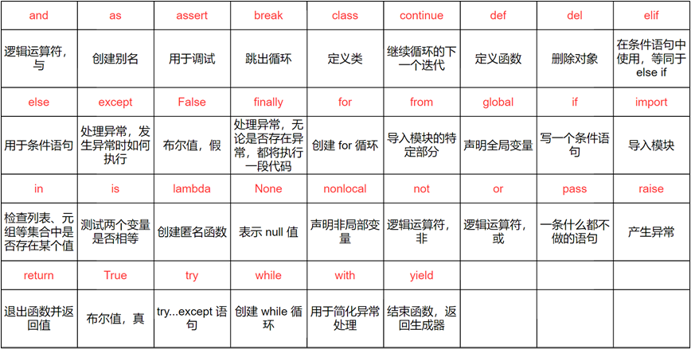

# python基础学习

## 基础知识

### 注释

注释就是在编写程序的时候，给代码添加的一些解释性的文字。
作用：提高代码的可读性，方便后续的修改
注释是解释性文本，在程序运行的时候，注释的文字会自动跳过，不做处理。

分类：

 单行注释：Python中 # 后的一行内的内容会被视为注释。 `# print("hello world")`
​ 多行注释(块注释)：Python中使用三个引号开始，三个引号结束（单引号或者双引号都可以）。’’’ 注释的文本 ‘’’ 或者 “”” 注释的文本 “””

```python
"""
Hello World
hello world
"""
```

注意： 如果单纯使用双引号，双引号的注释不能嵌套。

### 输入输出

print输出：将书写的程序的结果，输出到调试工具中。

input输入：将外部的值作为程序中变量的值使用[从控制台获取值]

### 变量

变量是在程序运行过程中，值可以随时发生改变。它的作用是存储数据。

变量创建方式：变量名 = 变量值

Python中的变量不需要声明。每个变量在使用前都必须赋值，变量赋值以后该变量才会被创建。

### 标识符

python中的标识符主要是指： 变量 函数 类 模块等名称

定义标识符的规则：

 1。只能是数字 字母 下划线组成。不可以是其他的字符
​ 2。标识符的开头不能是数字
​ 3。标识符不能是关键字
​ 4。严格区分大小写 age 和 AGE 是两个不同的标识符

关键字：在python中被赋予了某些特殊含义的单词。



### 数据类型

#### 基本数据类型：

 整数（int）、浮点数（float）、复数（complex）、布尔（bool）、字符串（str）

#### 容器数据类型：

 列表（list）、元组（tuple）、集合（set）、字典（dist）

#### 特殊数据类型：

 表示空值或缺失值，只有一个值 None。常用于函数没有返回值时，或者表示变量没有被赋值。

注意：

 整数（int）、浮点数（float）、String（字符串）、布尔（bool）、Tuple（元组）是不可变数据

 List（列表）、Dictionary（字典）、Set（集合）是可变数据

### 格式化字符串

#### f-string占位符：

 Python 3.6以后引入了一个新的格式化字符串的方法：f-string（formatted string），它可以直接把变量写在字符串中，使得格式化的字符串看起来很直观

#### 百分号占位符：

 在Python中，占位符是一种特殊的标记或占据字符串中的位置，用于表示在运行时将某个值插入到这个位置。占位符通常以百分号（%）开头，后跟一个字母或字母组合，表示不同的数据类型。Python中常用的占位符有：

- %s：字符串占位符，用于插入字符串
- %d：整数占位符，用于插入整数
- %f：浮点数占位符，用于插入浮点数
- %%：百分号占位符，用于插入百分号符号

```python
name = "小刘"
age = 24
float1 = 3.14159

print('大家好！我是小刘,今年24岁，pi取值3.14159')

# 百分号占位符写法：
print('大家好！我是%s,今年%d岁，pi取值%.2f' % (name, age, float1))

# f-string写法：
print(f'大家好！我是{name},今年{age}岁，pi取值{float1}')
```

#### 花括号占位符

```python
name = "Jack"
age = 25
print("My name is {} and I am {} years old.".format(name, age))

# 也可以定义名称a,b,然后在format中给a和b传值
print("My name is {a} and I am {b} years old.".format(a=name, b=age))
print("My name is {b} and I am {a} years old.".format(b=name, a=age))
```

### 运算符

#### 算术运算符

| **运算符** | **说明**           | **实例**  |
| ---------- | ------------------ | --------- |
| **+**      | 加                 | a + b     |
| **-**      | 减、或取负         | a - b、-a |
| *****      | 乘                 | a * b     |
| **/**      | 除                 | a / b     |
| **//**     | 整除，除后向下取整 | a // b    |
| **%**      | 模，返回除法的余数 | a % b     |
| ******     | 幂                 | a ** b    |

```python
num1 = 5
num2 = 3
print(num1 + num2)
print(num1 - num2)
print(num1 * num2)
print(num1 / num2)  #浮点型：1.6666666666666667    默认精度16位
print(num1 % num2)  #2
print(num1 ** num2) # 5的3次方
print(num1 // num2) # 获取浮点数的整数部分(向下取整)

# 除了+和-之外，其他的算术运算符都是相同的优先级
# 出现优先级，解决办法使用括号
print((2 ** 5) * 3)
```

#### 赋值运算符

| **运算符** | **说明**                                                     | **实例**                                           |
| ---------- | ------------------------------------------------------------ | -------------------------------------------------- |
| =          | 赋值                                                         | a = 1                                              |
| +=         | 加法赋值                                                     | a += 2，等同于a = a + 2                            |
| -=         | 减法赋值                                                     | a -= 2，等同于a = a - 2                            |
| *=         | 乘法赋值                                                     | a *= 2，等同于a = a * 2                            |
| /=         | 除法赋值                                                     | a /= 2，等同于a = a / 2                            |
| //=        | 整除赋值                                                     | a //= 2，等同于a = a // 2                          |
| %=         | 模赋值                                                       | a %= 2，等同于a = a % 2                            |
| =**        | 幂赋值                                                       | a ** = 2，等同于a = a ** 2                         |
| :=         | 海象运算符，在表达式中同时进行赋值和返回赋值的值。Python3.8 版本新增 | num1 = 20 print((num2 := 3**2) > num1) print(num2) |

```python
# 简单
num1 = 10
# 注意：在赋值运算符中，先计算等号右边的表达式，然后将计算的结果赋值给等号左边的变量
num2 = num1 + 10
print(num2)

# 复合运算符
num3 = 10
num3 += 100   #等价于num3 = num3 + 100
print(num3)
```

#### 关系【条件，比较】运算符

| **运算符** | **说明**           | **实例** |
| ---------- | ------------------ | -------- |
| **==**     | 相等，比较两者的值 | a == b   |
| **!=**     | 不相等             | a != b   |
| **>**      | 大于               | a > b    |
| **<**      | 小于               | a < b    |
| **>=**     | 大于等于           | a >= b   |
| **<=**     | 小于等于           | a <= b   |

```python
x = 3
y = 5
print(x > y)    #False
print(x < y) 

print(x == y)
print(x != y)

print(x >= y)  #False
print(x <= y)  #True
```

#### 逻辑运算符

| **运算符** | **说明**                                          |      |
| ---------- | ------------------------------------------------- | ---- |
| **and**    | 与，x and y，若x为False返回x的值，否则返回y的值   |      |
| **or**     | 或，x or y，若x为True返回x的值，否则返回y的值     |      |
| **not**    | 非，not x，若x为True返回False，若x为False返回True |      |

and短路操作:

- 2边都为True则为True, 有1边为False则为False
- 从左往右: 判断每个值是否为False,如果为False则直接返回该值,否则继续判断第二个数…

```python
print(0 and 4)  # 0
print(None and 3 and 5)  # None
print(3 and [] and 6)  # []
print(10 and print(666) and print(888))  # 666   None
```

or短路操作:

- 2边都为False则为False, 有1边为True则为True
- 从左往右: 判断每个值是否为True,如果为True则直接返回该值,否则继续判断第二个数…

```python
print(0 or 4)  # 4
print(3 or 4)  # 3
print(-2 or print(666) or print(888))
```

#### 位运算符

位运算时，以补码形式进行计算

| **运算符** | **说明** | **实例** |
| ---------- | -------- | -------- |
| **&**      | 按位与   | a & b    |
| **\|**     | 按位或   | a \| b   |
| **^**      | 按位异或 | a ^ b    |
| **~**      | 按位取反 | ~ a      |
| **<<**     | 按位左移 | a << 1   |
| **>>**     | 按位右移 | a >> 1   |

#### 成员运算符

| **运算符** | **说明**                                          | **实例**                 |
| ---------- | ------------------------------------------------- | ------------------------ |
| **in**     | 在指定的序列中找到值返回 True，否则返回 False     | a in [‘a’, ‘b’, ‘c’]     |
| **not in** | 在指定的序列中没有找到值返回 True，否则返回 False | a not in [‘a’, ‘b’, ‘c’] |

```python
num6 = 1
num7 = 20
test_list = [1,2,3,4,5]
print(test_list)
print(num6 in test_list) # True 判断1是不是列表中的的成员
print(num7 not in test_list) # True
```

#### 身份运算符

| **运算符** | **说明**                           | **实例**                                                     |
| ---------- | ---------------------------------- | ------------------------------------------------------------ |
| **is**     | 判断两个标识符是不是引用自相同对象 | a is b，类似id(a) == id(b)。如果引用的是同一个对象则返回True，否则返回False |
| **is not** | 判断两个标识符是不是引用自不同对象 | a is not b，类似id(a) != id(b)。如果引用的不是同一个对象则返回True，否则返回False |

```python
m = 20
n = 20
q = 30
print(m is n)  # True 判断m和n在内存中是否指向同一个地址
print(n is q)  # False
print(n is not q)  # True
# id() 用于获取对象在内存中的地址
print(id(m) == id(n)) # True

print("-" * 30)
# -------------is和==的区别---------------
a = [1,2,3]
b = a 

print(b is a)  # True
print(b == a)  # True

b = a[:]
print(b)
print(b is a)  # False
print(b == a)  # True
```

## 流程控制语句

顺序结构：代码从上往下依次执行

分支结构：根据不同的条件，执行不同的语句

循环结构: 根据指定的条件，重复执行某段代码

### 分支

#### if语句【单分支】

> 语法：
>
> if 表达式：
>
>  语句
>
> 说明; 要么执行，要么不执行，当表达式成立的之后，则执行语句；如果表达式不成立，则直接跳过整个if语句继续执行后面的代码
>
> 注意：表达式为真才会运行if中的语句

```python
# 单分支
num1 = 50
num2 = 60

# 在Python中，通过缩进来区分代码块
if num1 != num2:
	num1 = 100
	print(num1)
```

#### if-else语句【双分支】

> 语法：
>
> if 表达式：
>
>  语句1
>
> else:
>
>  语句2
>
> 说明：如果表达式成立，则执行语句1；如果不成立，则执行语句2

```python
num = int(input("请输入一个数："))

if num % 2 == 0:
	print(num,"是一个偶数")
else:
	print(num,"不是一个偶数")
```

#### if-elif-else语句多分支

> 语法：
>
> if 表达式1：
>
>  语句1
>
> elif 表达式2：
>
>  语句2
>
> elif 表达式3：
>
>  语句3
>
> …
>
> else:
>
>  语句n
>
> 说明：实现了多选一的操作，会根据不同的条件从上往下来进行匹配，如果匹配上了，则执行对应的语句，然后直接结束整个分支，但是，如果前面所有的条件都不成立的话，则执行else中的语句
>
> 注意：不管if-elif-else有多少个分支，都只会进入其中的一个分支

```python
age = int(input("请输入您的年龄："))
if age < 0:
	print("输入有误")
elif age <= 3:
	print("婴儿")
elif age <= 6:
	print("儿童")
elif age <= 12:
	print("青少年")
elif age < 18:
	print("青年")
else:
	print("恭喜你！成年了！")
```

#### 嵌套if语句

> 语法：
>
> if 表达式1：
>
>  语句1
>
>  if 表达式2：
>
>  语句2
>
> 说明：if语句的嵌套，可以在单分支，双分支，多分支之间进行任意组合

```python
score = int(input("请输入学生的成绩："))
if score < 0 or score > 100:
	 print("输入有误")
else:
   if score >= 90:
      print("优秀")
   elif score >= 80:
      print("良好")
   elif score >= 60:
      print("及格")
   else:
      print("不及格")
```

#### match case语句

> 语法:
>
> match x:
>
>  case a:
>
>  语句1
>
>  case b:
>
>  语句2
>
>  case _:
>
>  语句3
>
> 说明：match后的对象会依次与case后的内容匹配，匹配成功则执行相应语句，否则跳过。其中_可以匹配一切

```python
match month := 3:
    case 1 | 3 | 5 | 7 | 8 | 10 | 12:
        print(f"{month}月有31天")
    case 4 | 6 | 9 | 11:
        print(f"{month}月有30天")
    case 2:
        print(f"{month}月可能有28天")
    case _:
        print(f"{month}月有?天")
```

#### 三目运算符

> 语法：
>
> 表达式1 if 判断条件 else 表达式2

```python
num1 = 2
num2 = 3
max_num = num1 if num1 > num2 else num2
print(max_num)
```

### 循环

#### while循环

> 语法:
>
> while 表达式:
>
>  语句-循环体
>
> 执行流程:
> 先执行初始条件,然后判断循环条件是否满足,若满足循环条件,则执行循环,若不满足循环条件,结束循环.
>
> 注意: 初始化的表达式只会在第一次循环的时候执行一次

```python
# 需求:使用while的方式 输出1-100所有的数字
i = 1
while i <= 100:
    print(i)
    i += 1
```

while else语句:while 后可以加上 else，当 while 表达式结果为 False 时会执行 else 中的语句。

#### for循环 (for in)

1. range函数

   > 语法:
   > 注意: start 和 step 是可选参数,在调用函数的时候,这两个参数可以写也可以不写
   > range([start],end,[step])
   > start:表示开始的数字,默认从0开始 (包含start)
   > end:表示结束的数字 (不包含end)
   > step:表示步长(数字之间的间隔) (默认值为1)
   > 功能:是生成具有一定规律的序列
   > 注意:range生成的序列,包含开始的数字(start),数字截止到 end - 1 不包含end本身

   ```python
   list()  方法将元组或者字符串转换为列表
   print(list(range(0,10,1)))    # 表示0-10之间所有的数字
   print(list(range(5)))         # 表示0-5之间所有的数字
   print(list(range(1,10,2)))    # 表示1-10之间所有的奇数
   print(list(range(0,10)))      # 表示0-10之间所有的数字
   ```

2. for循环

   > 语法:
   > for 变量名 in 序列:
   > 循环体(循环中执行的语句块)

   ```python
   # 1.使用for 循环 输出 1-100之间所有的数字
   for i in range(1,101):
       print(i)
   
   # 2.使用for循环计算1-100之间所有的数字的和
   sum = 0
   for i in range(1,101):
       sum = sum + i
   print(sum)
   
   # 3.使用for循环输出1-100之间所有的奇数
   for i in range(1,101,2):
       print(i)
   
   
   # 使用for循环遍历列表中的元素
   stars = ["亦菲", "热巴","娜扎", "王菲", "杨洋", "坤"]
   
   # 访问列表中的元素使用下标访问,下标默认从0开始
   print(list[0])   # 访问列表中的第一个元素
   print(list[-1])  # 访问列表中的最后一个元素
   print(len(list))  # 获取列表中元素的长度
   
   
   # 第一种:通过for循环遍历列表元素的方式
   for star in stars:
       print(star)   # star表示列表中的每个元素
   
   # 第二种:
   for i in range(len(stars)):
       print(i,stars[i])
   
   
   # 第三种: enumerate(枚举)
   for j,star in enumerate(stars):
       print(j,star)
   ```

3. for…else 结构

   > 语法:
   > for i in 序列:
   > 循环体
   > else:
   > 其他的语句
   > 注意:
   > 1.for 循环中没有break语句时,当for循环执行完毕,才会执行else的语句块
   > 2.for 循环中有break语句执行时,不会执行else语句块

4. 循环嵌套

   > while循环和for循环可以嵌套使用.一般情况下嵌套的层级不会超过3层.
   >
   > for 循环嵌套语法:
   >
   > for i in 序列:
   > for j in 序列2:
   > 循环体
   >
   > while循环嵌套语法:
   >
   > 初始条件1
   > while 终止条件1:
   >
   >  初始条件2:
   > ​ while 终止条件2:
   > ​ 循环体
   > ​ 更新条件2
   >
   >  更新条件1
   >
   > 总结:for循环一般用于已知循环次数的情况
   >
   >  while循环一般可以用于未知循环次数或者死循环中.

   ```python
   # 使用双重循环实现9*9 乘法表
   for i in range(1,10):
       for j in range(1,i+1):
           print(f"{j}*{i}={i*j}",end="\t")
       print()  
   
   # 使用双重循环,while实现9*9乘法表
   i = 0 
   while i < 9:
       i += 1
       j = 0
       while j < i:
           j += 1
           print(i,"*",j,"=",(i*j),end = " ")
       print()
   ```

#### break

作用:跳出整个循环.继续执行循环外面的程序

```python
i = 1
while i <= 10:
    if i == 3:
        break
    print(i)
    i += 1
print("hello world")
```

#### continue

作用:跳出当前循环,继续执行下一个循环

```python
i = 1
while i <= 10:
    if i == 3:
        i += 1
        continue
    print(i)
    i += 1
print("hello world")   
```

#### pass

pass 不做任何事情,一般做为占位语句,是为了保证程序结构的完整性

```python
for i in range(10):
    pass
```

### 列表

> 语法:
>
>  变量名 = 列表
>
>  列表名称 = [数据1,数据2……..]
>
> 说明: 使用 [ ] 表示创建列表
>
>  列表中存储的数据为元素
>
>  列表中的元素从头到尾进行了编号.编号从0开始, 这个编号被称为下标 或者 索引 或者 角标
>
>  索引的取值范围: 0 - 元素的个数-1
>
>  超过索引的范围: 列表越界
>
> 列表是一个可变的、有序的元素集合

#### 创建列表

```python
# 1.创建列表
	list1 = []   # 空列表
# 2.带元素的列表
	list2 = ["五菱宏光", "哈弗", "小米汽车", "欧拉"]
# 3.列表中的元素可以是不同的数据类型
	list3 = [12, 3.13, True, False, "hello", "路西"]
```

#### 列表元素的访问

1.通过索引获取列表中元素

```python
list1 = [100, 200, 300, 400, 500]
list1[0]   # 表示第一个元素
list1[-1]  # 表示最后一个元素
len(list1)  # 表示获取列表元素的个数
list1[11]  # 超出索引范围
```

2.替换元素（修改元素的值）

```python
# 通过下标修改
list1 = [100, 200, 300, 400, 500]
# 修改列表元素   语法:列表名[索引] = 值
list1[0] = -1
print(list1)

# 通过切片修改
list1 = [100, 200, 300, 400, 500]
list1[2:4] = ["a", "b", "c"]
print(list1)
```

3.遍历列表

```python
list1 = [100, 200, 300, 400, 500]

# 第一种方式: 直接遍历列表元素
for i in list1:
    print(i)

# 第二种方式: 通过索引的方式访问元素
for i in range(len(list1)):
    print(i, list1[i])

# 第三种方式:enumrate() 同时遍历索引和元素
for i, val in enumerate(list1):
    print(i, val)
```

#### 列表的操作

1.列表切片

```python
list1 = [100, 200, 300, 400, 500]
print(list1)  # 取全部元素
print(list1[:])  # 复制整个列表
print(list1[2:4])  # 取索引从2开始到4(不包含)的元素
print(list1[2:])  # 取索引从2开始到末尾的元素
print(list1[:2])  # 取索引从0开始到2(不包含)的元素
print(list1[2:-1])  # 取索引从2开始到-1(不包含)的元素
print(list1[::-1])  # 倒序取元素
```

2.向列表中添加元素

```python
list1 = [100, 200, 300, 400, 500]
list1.append(600) # 在列表末尾追加元素
list1.insert(2,700) # 在列表指定的位置追加元素
print(list1)
```

3.列表相加

```python
list1 = [100, 200, 300]
list2 = ["a", "b", "c"]
print(list1 + list2)  # [100, 200, 300, 'a', 'b', 'c']
```

4.列表乘法（列表元素重复）

```python
list1 = [100, 200, 300]
print(list1 * 2)  # [100, 200, 300, 100, 200, 300]
```

5.检查成员是否为列表中元素

```python
list1 = [100, 200, 300]
print(100 in list1)  # True
```

6.获取列表长度

```python
list1 = [100, 200, 300]
print(len(list1))  # 3
```

7.求列表中元素的最大值、最小值、加和

```python
list1 = [100, 200, 300, 400, 500]
print(max(list1))  # 500
print(min(list1))  # 100
print(sum(list1))  # 1500
```

8.删除列表指定位置元素或者切片

```python
list1 = [100, 200, 300, 400, 500]
del list1[2]
print(list1)
```

9.嵌套列表

```python
list1 = [[1, 2, 3], [4, 5, 6], [7, 8, 9]]
for inner_list in list1:
    print(inner_list)
```

10.列表推导式

```python
# 基础的列表推导式
squares = [x**2 for x in range(5)]
print(squares)  # [0, 1, 4, 9, 16]

# 带条件的列表推导式
squares = [x**2 for x in range(10) if x % 2 == 0]
print(squares)  # [0, 4, 16, 36, 64]

# 使用现有列表的列表推导式
list1 = [1, 2, 3, 4, 5]
squares = [x**2 for x in list1]
print(squares)  # [1, 4, 9, 16, 25]

# 包含多个循环的列表推导式
list1 = [1, 2, 3, 4, 5]
list2 = ["a", "b", "c", "d", "e"]
tuple_list = [(i, j) for i in list1 for j in list2]
print(tuple_list)
```

11.zip()函数

```python
list1 = [1, 2, 3, 4, 5]
list2 = ["a", "b", "c", "d", "e"]
zipped = zip(list1, list2)
print(list(zipped))
```

#### 常用函数

| **函数**                         | **说明**                                          |
| -------------------------------- | ------------------------------------------------- |
| **list.insert(index,x)**         | 在指定位置插入x                                   |
| **list.append(x)**               | 在列表末尾追加x                                   |
| **list1.extend(list2)**          | 在列表1的末尾追加列表2的数据                      |
| **del list[index]**              | 删除指定位置的数据或切片                          |
| **list.remove(x)**               | 删除第一次出现的x                                 |
| **list.pop([index])**            | 删除指定位置的数据，默认为末尾数据                |
| **list.clear()**                 | 清空列表中元素                                    |
| **list[index] = x**              | 修改指定位置的数据                                |
| **list1[start:end] = list2**     | 修改列表切片的数据                                |
| **sorted(list[,reverse=True])**  | 返回排序后的新列表，可选降序                      |
| **list.sort([reverse=True])**    | 对列表就地排序，可选降序                          |
| **list.reverse()**               | 反转列表中的元素                                  |
| **list.index(x[,start,[,end]])** | 返回x在列表中首次出现的位置，可指定起始和结束范围 |
| **list.count(x)**                | 返回x的数量                                       |
| **len(list)**                    | 返回列表元素个数                                  |
| **max(list)**                    | 返回列表中最大值                                  |
| **min(list)**                    | 返回列表中最小值                                  |
| **sum(list)**                    | 返回列表中所有元素和                              |
| **list.copy()**                  | 拷贝列表                                          |
| **list(x)**                      | 将序列转换为列表                                  |

### tuple元组

> 元组是一个不可变的、有序的元素集合。
>
> 列表中的元素可以进行增加和删除操作，但是，元组中的元素不能修改
>
> 【元素：一旦被初始化，将不能发生改变】

#### 创建元组

1.创建空元组

```python
tuple1 = ()
print(type(tuple1))  # <class 'tuple'>
```

2.创建带有元素的元组

```python
tuple2 = (12,34,6,87)
print(tuple2)
print(type(tuple2))  # <class 'tuple'>
```

3.元组中的元素可以是各种类型

```python
tuple3 = (12,34,4.12,"hello",True)
print(tuple3)

# 注意:创建的元组只有一个元素时, 会在元素的后面加上一个逗号 ,
tuple4 = (2)
print(tuple4)
print(type(tuple4))  # <class 'int'> 

tuple5 = (3,)
print(tuple5)
print(type(tuple5))  #<class 'tuple'>
```

#### 访问元组

1.访问元组的元素,使用下标访问,下标默认从0开始

```python
tuple1 = (100, 200, 300, 400, 500)
print(tuple1[2])
print(tuple1[-1])
print(tuple1[2:4])
```

2.元组的元素的值不能进行修改

```python
# tuple1[2] = 99
# print(tuple1)  # 'tuple' object does not support item assignment
```

3.遍历元组

```python
tuple1 = (100, 200, 300, 400, 500)
# 第一种方式: for-in
for i in tuple1:
    print(i)
# 第二种方式: 通过下标访问
for i in range(len(tuple1)):
    print(i, tuple1[i])
# 第三种方式: enumrate() 返回索引和元素
for i, val in enumerate(tuple1):
    print(i, val)
```

#### 元组的操作

1.合并元组 +

```python
tuple1 = (100, 200, 300)
tuple2 = ("a", "b", "c")
print(tuple1 + tuple2)  # (100, 200, 300, 'a', 'b', 'c')
```

2.重复元组中的元素 *

```python
tuple1 = (100, 200, 300)
print(tuple1 * 2)  # (100, 200, 300, 100, 200, 300)
```

3.判断指定元素是否在元组中 使用成员运算符 in 和 not in

```python
tuple1 = (100, 200, 300, 400, 500)
print(300 in tuple1)  # True
```

4.元组的截取(切片)

```python
tuple4 = (12,3,5,7,98)
print(tuple4[1:4])   # (3, 5, 7)
print(tuple4[-1:])  # (98,)
print(tuple4[:2])   # (12, 3)
```

5.获取元组长度

```python
tuple1 = (100, 200, 300, 400, 500)
print(len(tuple1))  # 5
```

6.求元组中元素的最大值、最小值、加和

```python
tuple1 = (100, 200, 300, 400, 500)
print(max(tuple1))  # 500
print(min(tuple1))  # 100
print(sum(tuple1))  # 1500
```

7.其他数据类型转换为元组 tuple()

```python
list1 = [12,34,57,89]
print(type(list1))  # <class 'list'>
print(type(tuple(list1))) # <class 'tuple'>
```

#### 元组的不可变

元组的不可变指的是元组所指向的内存中的内容不可变，但可以重新赋值。

```python
tuple1 = (100, 200, 300)
print(id(tuple1), tuple1)
tuple1 = tuple1 + (1, 2, 3)
print(id(tuple1), tuple1)
```

### 字典Dictionary

> 语法： {键1: 值1, 键2: 值2, 键3: 值3, …, 键n: 值n}
>
> 一个无序的键值对集合，键是唯一的，而值可以重复
>
> 字典没有索引，字典可以通过键来获取对应的值
>
> 值可以取任何数据类型，但键必须是不可变的，如字符串、数字、元组

#### 创建字典

```python
# 1.定义空字典 {}
dict1 = {}
print(type(dict1))  # <class 'dict'>

# 2.定义非空字典
# 第一种定义字典的方式
dict2 = {"name":"小明","age":25,"sex":"男","love":"篮球"}  # 最常用
print(dict2)
print(type(dict2))
print(dict2["name"], dict2["love"])  # 访问字典
```

#### 访问字典

1.访问字典中的元素

```python
# 第一种方式: 直接通过下标访问
dict1 = {"name":"中国医生", "author":"刘伟强", "person":"张涵予"}
print(dict1['author'])
# print(dict1['money'])  # 访问字典中不存在的key时,直接报错

# 第二种方式:通过get()方法获取
print(dict1.get('name'))
print(dict1.get('money'))  # None   访问字典中不存在的key时,返回None
print(dict1.get('money',10000))  # 访问字典中不存在的key时,若传递了第二个参数,则使用第二个参数的值
```

2.遍历字典

```python
#  第一种方式: for in
for key in dict1:  # 遍历字典中所有的key
    print(key)
   
# 第二种方式:遍历 字典中所有的值
for v in dict1.values():
    print(v)

# 第三种方式: items  遍历字典中所有的key和value
for k,v in dict1.items():
    print(k,'----',v)
```

#### 字典的操作

1.向字典中添加元素

```python
dict1 = {"name": "Alice", "age": 18, "gender": "male"}
dict1["address"] = "earth"
print(dict1)
```

2.修改字典中元素

```python
dict1 = {"name": "Alice", "age": 18, "gender": "male"}
dict1["name"] = "Bob"
print(dict1)
```

3.删除字典元素

```python
my_dict = {'Name': 'Tom', 'Age': 17}
del my_dict['Name'] # 删除键 'Name'
# my_dict.clear()     # 清空字典
# del my_dict         # 删除字典
print (my_dict)

#或者：
# 第一种:pop() 删除指定的元素
#my_dict.pop("Name")
print(my_dict)
# 第二种:popitem()  随机返回并删除字典中的最后一对key和value
my_dict.popitem()
print(my_dict)
```

4.获取字典的长度 len()

```python
dict1 = {"name": "Alice", "age": 18, "gender": "male"}
print(len(dict1))  # 3
```

5.检查成员是否为字典中的key

```python
dict1 = {"name": "Alice", "age": 18, "gender": "male"}
print("name" in dict1)  # 检查key是否存在
print("Alice" in dict1)  # 无法直接检查value是否存在
```

6.获取字典中所有的key

```python
print(dict1.keys())  # dict_keys(['name', 'author', 'person'])
```

7.获取字典中所有的value

```python
print(dict1.values()) # dict_values(['中国医生', '刘伟强', '张涵予'])
```

8.获取字典中的所有的key和value items()

```python
print(dict1.items())  # dict_items([('name', '中国医生'), ('author', '刘伟强'), ('person', '张涵予')])
```

9.合并字典 update()

```python
dict2 = {"name":"刘哥","money":"1999","age":23}
dict3 = {"sex":"男"}
dict2.update(dict3)
print(dict2)
```

#### 赋值、深拷贝、浅拷贝

```python
# 赋值: 其实就是对象的引用(别名)
list = [12,34,57,9]
list1 = list
list[1] = 78
# print(list,list1)

# 浅拷贝: 拷贝父对象,不会拷贝对象内部的子对象.浅拷贝一维列表的时候,前后两个列表是独立的.
import copy
a = [12,35,98,23]  # 一维列表
b = a.copy()
a[1] = 67
# print(a,b)

# 浅拷贝在拷贝二维列表的时候,只能拷贝最外层列表,不能拷贝父对象中的子对象,当修改子对象中的值的时候,新拷贝的对象也会发生变化
c = [14,53,25,[31,89,26],42] # 二维列表
d = c.copy()
c[3][1] = 11
print(c,d)

# 若要解决浅拷贝处理二维列表时的问题,需要使用深拷贝解决
e = [14,53,25,[31,89,26],42] # 二维列表
f = copy.deepcopy(e)
e[3][1] = 11
print(e,f)
```

### 集合Set

> 集合是无序的，且不包含重复元素
>
> 集合没有索引，所以不能通过切片方式访问集合元素
>
> 集合可以进行数学上的集合操作，如并集、交集和差集

#### 创建集合

```python
set1 = {1, 2, 3}
set2 = set([1, 2, 3])  # 使用set()函数从列表创建集合
set3 = set()
print(set1, set2, set3)

# 也可以通过集合推导式创建集合
set1 = {x for x in range(10) if x % 2 == 0}
print(set1)  # {0, 2, 4, 6, 8}
```

#### 集合的操作

1.获取集合的长度 len()

```python
print(len(set2))  # 4
```

2.集合不能通过下标访问元素

```python
# print(set2[3])
```

3.向集合中添加元素 add()

```python
set2 = {12,345,633,21}
set2.add(98)
print(set2)
```

4.通过update() 向集合中添加多个元素 追加的元素以列表的形式出现

```python
set2.supdate([1,2,3])
print(set2)
```

5.从集合中删除元素

```python
set1 = {12,345,633,21}
# remove() 删除指定的元素,传入的参数是要删除的元素,如果删除的元素不存在,会报错
set1.remove(2)
print(set1)

# pop() 随机删除一个
set1.pop()
print(set1)

# discard()删除指定的元素,传入的参数是要删除的元素,如果删除的元素不存在,不会报错
set1.discard(21)
# set1.discard(22)
print(set1)
```

6.clear() 清空集合

```python
set2.clear()
#print(set2)
```

7.检查成员是否为集合中元素

```python
set1 = {1, 2, 3, 4, 5}
print(2 in set1)  # True
```

8.求集合中元素的最大值、最小值、加和

```python
set1 = {1, 2, 3, 4, 5}
print(max(set1))  # 5
print(min(set1))  # 1
print(sum(set1))  # 15
```

9.遍历集合

```python
set1 = {12,345,633,21}
for i in set1:
 	print(i)
```

10.交集和并集

```python
set5 = {12,34,56,23,86}
set4 = {23,45,25,12,41}
print(set5 & set4)  # 交集
print(set5 - set4)  # 差集
print(set5 | set4)  # 并集
print(set4 > set5)  # set4是否包含set5
print(set4 < set5)  # set5是否包含set4
```

### 列表、元组、字典和集合的区别

| **数据结构**           | **是否可变** | **是否重复**     | **是否有序**                            | **定义符号** |
| ---------------------- | ------------ | ---------------- | --------------------------------------- | ------------ |
| **列表（List）**       | 可变         | 允许             | 有序                                    | []或list()   |
| **元组（Tuple）**      | 不可变       | 允许             | 有序                                    | ()或tuple()  |
| **字典（Dictionary）** | 可变         | 键不允许，值允许 | 键无序（Python 3.7+版本中保持插入顺序） | {}或dict()   |
| **集合（Set）**        | 可变         | 不允许           | 无序                                    | {}或set()    |

### str字符串

> 字符串是不可变的、有序的。
>
> 字符串中元素不可修改。
>
> 字符串使用单引号、双引号或三重引号定义。

#### 创建字符串

```python
# 创建字符串
str = "apple"
str1 = 'orange'
print(type(str), type(str1))
```

#### 访问字符串

1.访问字符串中的内容可以通过下标访问

```python
str1 = "hello world"
print(str1[0])
print(str1[-1])
```

2.遍历字符串

```python
# 第一种方式: for in
for i in str4:
	print(i) 

# 第二种方式: 通过下标
for i in range(len(str4)):
	print(str4[i])

# 第三种方式:enumrate()
for i,v in enumerate(str4):
	print(i,v,end=" ")
```

#### 字符串操作

1.字符串拼接使用 +

```python
str1 = "welcome to "
str2 = " china"
num = 19
print(str1 + str2)
# print(str1 + num)   # 注意,+ 只能用于字符串和字符串之间进行拼接
```

2.字符串重复 *

```python
str1 = "hello world"
print(str1 * 2)  # hello worldhello world
```

3.字符串截取(切片)

```python
ss1 = "good good study,day day up"
print(ss1[1:6])  # ood g
print(ss1[2:])   # od good study,day day up
print(ss1[:9])   # good good
print(ss1[-1])   # p
print(ss1[1::2]) # odgo td,a a p   # 将步长设置为2
print(ss1[::-1])  # pu yad yad,yduts doog doog   # 将字符串实现翻转
```

4.检查成员是否为字符串中元素

```python
str1 = "hello world"
print("lo" in str1)  # True
```

5.字符串前加 r, r”” 的作用是去除转义字符.

```python
print(r"hello\nworld")
```

6.获取长度和次数

```python
str1 = "hello world!"
# 获取字符串的长度 len() 
print(len(str1))

# count() 在整个字符串中查找子字符串出现的次数
str = "电脑卡了,ss电脑呢?"
print(str.count("电脑"))   # 2
```

#### 字符串大小写转换

```python
# upper()将字符串中的小写字母转换为大写
str1 = "i Miss you Very Much!"
print(str1.upper())  # I MISS YOU VERY MUCH!

# lower() 将字符串中的大写字母转化为小写
print(str1.lower())  # i miss you very much!

# swapcase   将字符串中的大写转换为小写,将小写转换为大写
print(str1.swapcase())  # I mISS YOU vERY mUCH!

# title()  将英文中每个单词的首字母转换为大写
str2 = "i love you forever!"
print(str2.title())  #   I Love You Forever!
```

#### 字符串查找

```python
# 查找 find() 查找子串在字符串中第一次出现的位置, 返回的是下标,若未找到返回-1
ss3 = "123asdfASDCXaZ8765sahbzcd6a79"
print(ss3.find("a"))  # 3
print(ss3.find("y"))  # -1  未找到子串,返回-1
# 在指定区间内查找
print(ss3.find("a",5,20))  # 12

# rfind 查找子串在字符串中最后一次出现的位置,返回的是下标,若未找到返回-1
print(ss3.rfind("a"))  # 25
print(ss3.rfind("y"))  # -1

# index() 功能和find类似  在字符串中未找到的时候,直接报错 (了解)
print(ss3.index("d"))  # 5
# print(ss3.index("y"))  # ValueError: substring not found
```

#### 字符串提取

```python
# 提取 # strip() 去除字符串两边的指定字符(默认去除的是空格)
ss4 = "  today is a nice day  "
ss5 = "***today is a nice day****"
print(ss4)
print(ss4.strip())
print(ss5)
print(ss5.strip("*"))

# lstrip 只去除左边的指定字符(默认去除的是空格)
print(ss5.lstrip("*"))
# rstrip 只去除右边的指定字符(默认去除的是空格)
print(ss5.rstrip("*"))
```

#### 字符串分割和合并

```python
# 分割和合并 # split() 以指定字符对字符串进行分割(默认是空格)
ss6 = "this is a string example.....wow!"
print(ss6.split()) # 以空格进行分割 ['this', 'is', 'a', 'string', 'example.....wow!']
print(ss6.split("i"))

# splitlines()  按照行切割
ss7 = '''将进酒
君不见黄河之水天上来,
奔流到海不复回.
君不见高堂明镜悲白发,
************.
'''
print(ss7)
print(ss7.splitlines())

# join 以指定字符进行合并字符串
ss8 = "-"
tuple1 = ("hello","every","body")
print(tuple1)
print(ss8.join(tuple1))  # hello-every-body
```

#### 字符串替换

```python
# replace() 对字符串中的数据进行替换
ss9 = "国家主席习近平,习近平是一个伟人,我们感谢习近平主席"
print(ss9)
print(ss9.replace("习近平","***"))
# 控制替换的字符的次数
print(ss9.replace("习近平","***",2))
```

#### 字符串判断

```python
# isupper() 检测字符串中的字母是否全部大写
print("ASDqwe123".isupper())  # False
print("ASD123".isupper())  # True

# islower() 检测字符串中的字母是否全部小写
print("ASDqwe123".islower())  # False
print("qwe123".islower())  # True

# isdigit() 检测字符串是否只由数字组成
print("1234".isdigit())  #True
print("1234asd".isdigit())  # False

#istitle()  检测字符串中的首字母是否大写
print("Hello World".istitle()) # True
print("hello everybody".istitle())  # False

# isalpha() 检测字符串是否只由字母和文字组成
print("你好everyone".isalpha())  # True
print("你好everyone123".isalpha())  # False
```

#### 前缀和后缀

```python
# 前缀和后缀  判断字符串是否以指定字符开头或者以指定字符结束
# startswith()   判断字符串是否以指定字符开头
# endwith() 判断字符串是否以指定字符结束
s1 = "HelloPython"
print(s1.startswith("Hello")) # True
print(s1.endswith("thon")) # True
```

#### 编码解码

```python
# encode() 编码
# decode() 解码
s2 = "hello 中国"
s3 = s2.encode()
print(s2.encode()) 
print(s2.encode("utf-8")) 
print(s2.encode("gbk"))

# 解码
print(s3.decode())  # hello 中国
```

### 函数

#### 定义函数

> 语法:
>
> def 函数名(参数1，参数2，参数3….):
>
>  函数体
>
>  返回值(可以有也可以没有,根据具体的场景)
>
> 说明：
>
>  a.函数由两部分组成：声明部分和实现部分
>
>  b. def,关键字，是define的缩写，表示定义的意思
>
>  c. 函数名：类似于变量名，遵循标识符的命名规则，尽量做到见名知意
>
>  d.（）：表示的参数列表的开始和结束
>
>  e. 参数1，参数2，参数3…. ：参数列表【形式参数，简称为形参】，其实本质上就是一个变量名，参数列表可以为空
>
>  f.函数体：封装的功能的代码
>
>  g.返回值：一般用于结束函数，可有可无，如果有返回值，则表示将相关的信息携带出去，携带给调用者，如果没有返回值，则相当于返回None
>
> 注意：
>
>  函数必须先定义再调用

#### 使用函数

1.有参数的函数

```python
def my_sum(a,b):    # a,b就是形参
    print(a + b)
    
my_sum(12,23)  # 12,23就是实参
```

2.没有返回值的函数

```python
def say():
    print("我是没有返回值的函数")
    
say()
```

3.有返回值的函数

```python
# 有返回值的函数:  通过return关键字返回数据
def demo():
    return "我是有返回值的函数"

str = demo()
print(str)


# 1.return 后面可以返回一个或者多个数据,返回多个数据,以元组的形式展示出来
# 2.return 下面的代码不会执行

def demo1():
    print("哈!")
    return 12,34,578
    print("haha")   # 不会执行
tuple1 = demo1()
print(tuple1)  # (12, 34, 578)

# 函数中没有return或者return后面没有数据返回,则默认返回的是None
def demo2():
    return
print(demo2())  # None

# 注意:
#     1.有返回值的函数,使用return关键字将数据返回,若想使用返回的数据,
#        需要在调用函数的位置定义一个变量接收返回的数据.
#     2.return 返回的数据可以是一个或者多个,返回的多个数据是以元组的形式展示.
#	    3.return关键词下面的代码不会执行.
#	    4.在函数中若不写return 或者 return后面没有返回具体的数据,则返回的是None
```

4.函数嵌套函数

```python
函数之间可以进行相互嵌套调用
def test():
	test1()
	print(11111)

def test1():
	test2()
	print(22222)

def test2():
	test3()
	print(333333)

def test3():
	print(44444)

test()
```

5.函数中的参数

> 分类：
>
>  形式参数：在函数的声明部分，本质就是一个变量，用于接收实际参数的值 【形参】
>
>  实际参数：在函数调用部分，实际参与运算的值，用于给形式参数赋值 【实参】
>
>  传参：实际参数给形式参数赋值的过程，形式参数 = 实际参数

```python
def get_max(num1,num2): # num1,num2是形参
  if num1 > num2:
     return num1
  else:
     return num2

max_value = get_max(12,345)  # 12,345是实参
print(max_value)
```

> 传递不可变对象
>
> 类似c++的值传递，如整数、字符串、元组。如fun（a），传递的只是a的值，没有影响a对象本身。比如在fun（a）内部修改a的值，只是修改另一个复制的对象，不会影响 a 本身。

```python
def changeInt(a) :
    print("函数体中未改变前a的内存地址",id(a))
    a = 10
    print("函数体中改变后a的内存地址",id(a))

b = 2
changeInt(b)
print(b)
print("函数外b的内存地址",id(b))
输出结果：
函数体中未改变前a的内存地址 140711474555352
函数体中改变后a的内存地址 140711474555608
2
函数外b的内存地址 140711474555352
```

> 传递可变对象
>
> 类似c++的引用传递，如列表，字典。如 fun（la），则是将 la 真正的传过去，修改后fun外部的la也会受影响

```python
def changeList(myList) :
    myList[1] = 50
    print("函数内的值",myList)
    print("函数内列表的内存",id(myList))

mlist = [1,2,3]
changeList(mlist)
print("函数外的值",mlist)
print("函数外列表的内存",id(mlist))
输出结果：
函数内的值 [1, 50, 3]
函数内列表的内存 1546427570560
函数外的值 [1, 50, 3]
函数外列表的内存 1546427570560
```

6.参数的类型

> a.必需参数/位置参数
>
>  调用函数的时候必须以正确的顺序传参，传参的时候参数的数量和形参必须保持一致

```python
# 必需参数
def student(name,age):
	 print("我的姓名是%s,年龄是%d"%(name,age))

student("jeff",18)
# student(18,"jeff")  # %d format: a number is required, not str
```

> b.关键字参数
>
>  使用关键字参数允许函数调用的时候实参的顺序和形参的顺序可以不一致，可以使用关键字进行自动的匹配

```python
def student(name,age):
	print("我的姓名是%s,年龄是%d"%(name,age))

student(age = 22,name = "lucy")
```

> c. 默认参数(默认参数是在函数定义的时候,直接给形参赋的值)
>
>  调用函数的时候，如果没有传递参数，则会使用默认参数,如果传输了参数,则使用传递的参数.

```python
def get_sum(num1,num2 = 12):
	print(num1+num2)

get_sum(23)
get_sum(23,87)

# 注意:
# 	如果函数中有多个形参,给该函数设置默认参数时,一般把这个默认参数放在形参列表的最后面.
```

> d.不定长参数(可变参数)
>
>  可以处理比当初声明时候更多的参数 *(元组) **(字典)
>
>  *args: 用来接收多个位置参数 argments 得到的形式是 元组
>
>  **kwargs: 用来接收多个关键字参数 keyword arguments 得到的形式是字典

```python
# 不定长参数: *args   **kwargs
def fn(*args):
	 print(args)

fn(34,533,4,3)

# 注意:
'''
在自定义函数时,若函数中有多个参数,某一个参数是不定长参数,一般把不定长参数放在参数列表的最后面.
'''
def fn1(name,*args):
	 print(name,args)
fn1("赵杰",12,345,6,"hehe",True)

# **kwargs 接收的是关键字参数,格式是 key=value这种形式
def fn2(**kwargs):
	 print(kwargs)
fn2(x = 10,y = 12,z = 88) 
```

> e.解包传参
>
> 若函数的形参是定长参数，可以通过 * 和 ** 对列表、元组、字典等解包传参

```python
def func(a, b, c):
    return a + b + c

tuple11 = (1, 2, 3)
print(func(*tuple11))
# 字典中key的名称和参数名必须一致
dict1 = {"a": 1, "b": 2, "c": 3}
print(func(**dict1))
```

> f.强制使用位置参数或关键字参数
>
> / 前的参数必须使用位置传参，* 后的参数必须用关键字传参

```python
def f(a, b, /, c, d, *, e, f):
    print(a, b, c, d, e, f)

f(1, 2, 3, d=4, e=5, f=6)
```

> g.防止函数修改列表
>
> 有时要函数对列表进行处理，又不希望函数修改原列表，可以使用 copy.deepcopy()

```python
import copy

def multiply2(var1):
    var1[3].append(400)
    print("函数内处理后：", var1)

list1 = [1, 2, 3, [100, 200, 300]]
print("函数外处理前：", list1)
multiply2(copy.deepcopy(list1))
print("函数外处理后：", list1)
```

#### 匿名函数

> 特点：
>
>  a.lambda只是一个表达式，比普通函数简单
>
>  b.lambda一般情况下只会书写一行，包含参数，实现体，返回值
>
> 语法:lambda 参数列表 ： 实现部分

```python
# 匿名函数: lambda
def fn(n):
	return n**2
print(fn(3))

# 匿名函数
f1 = lambda n: n**2
print(f1(3))

# 匿名函数
f2 = lambda x,y:x*y
print(f2(12,3))
```

#### 闭包

> 如果在一个外部函数中定义一个内部函数，并且外部函数的返回值是内部函数，就构成了一个闭包，则这个内部函数就被称为闭包

```python
# 外部函数
def outer():
     # 内部函数
     def inner():
         print("hello")
     return inner  # 将内部函数返回

fn = outer()    # fn =====> inner函数
fn()    # 相当于调用了inner函数   输出 hello


# 内部函数使用外部函数的变量
def outer1(b):
    a = 10
    def inner1():
        # 内部函数可以使用外部函数的变量
        print(a + b)
 	return inner1

fun1 = outer1(12)
fun1()

'''
注意:
1.当闭包执行完毕后,仍然能够保存住当前的运行环境
2.闭包可以根据外部作用域的局部变量得到不同的效果,类似于配置功能,类似于我们可以通过修改外部变量,闭包根据变量的改变实现不同的功能.
应用场景: 装饰器
'''
```

#### 装饰器

> 在代码运行期间，可以动态增加函数功能的方式，被称为装饰器

```python
# 原函数
def test():
	print("你好啊!")
# 需求: 给上面的函数test增加一个功能, 输出 我很好
# 第三种方式: 通过装饰器的方式给函数追加功能   装饰器使用闭包实现

# a.书写闭包函数    此处的outer函数就是装饰器函数
def outer(fn):  # b. fn表示形参,  实际调用的时候传递的是原函数的名字
     def inner():
        fn()  # c.调用原函数
        # d. 给原函数添加功能,   注意:添加的功能可以写在原函数的上面也可以写在原函数的下面
        print("我很好")
     return inner

print("添加装饰器之前:",test,__name__)   
test = outer(test)
print("添加装饰器之后:",test,__name__) # 

test()

# 总结:
# 1.在装饰器中,给原函数添加的功能,可以写在原函数的上面,也可以写在原函数的下面
# 2.outer 函数就是我们的装饰器函数
```

#### 变量的作用域

> 局部作用域：L【Local】
>
> 函数作用域：E【Enclosing】 将变量定义在闭包外的函数中
>
> 全局作用域：G【Global】
>
> 內建作用域：B【Built-in】

```python
def fn():
	 c = 99
# print(c)  # name 'c' is not defined
# 1.函数内部定义的变量在函数外部不能访问.

# 全局作用域:
num1 = 12    # 全局作用域,在函数内部和外部可以直接访问
def test():
	num2 = 87  # 函数作用域
  	print(num1)

  	# print(num3)   # name 'num3' is not defined
  	def inner():
        num3 = 55   # 局部作用域
        # 在内部函数中,可以访问全局作用域\函数作用域\局部作用域的变量
        print(num1,num2,num3)
    return inner

test()
print(num1)

fn = test()
fn()

n = int("28")   # builins 内置函数在调用的时候的作用域,这是python解释器自己定义的.
```

#### global和nonlocal关键字的使用

> 当内部作用域【局部作用域，函数作用域】想要修改全局变量的作用域的时候

```python
# 若想在函数的内部,对全局变量进行修改,需要使用global关键字
num1 = 11
def test1():
	# 通过global关键字将函数内部声明变量变为了全局变量
	global num1
	num1 = 75
	print(num1)

test1()   # 75
print(num1)  # 75
# nolocal关键字用于闭包函数中
x = 15  # 全局变量
def outer():
	x = 19
	def inner():
       # x = 23
       # global x   # 使用的是 x = 15
       nonlocal x  # 这时候使用的变量是 x = 19
       x += 1
       print("inner:",x)
	return inner


# 闭包会保存住当前的运行环境
test = outer()
test()   # 20
test()   # 21
test()   # 22

num = 11
def demo():
	print(num)

demo()   # 11
demo()   # 11
demo()   # 11
```

### 文件操作

#### 文件的打开与关闭

| **模式** | **说明**                                                   |
| -------- | ---------------------------------------------------------- |
| **r**    | 读写方式：只读，文件若不存在会报错。默认此模式             |
| **w**    | 读写方式：写入，写入前清空原有数据。文件不存在会创建文件   |
| **a**    | 读写方式：追加写入，在原有数据后追加，文件不存在会创建文件 |
| **x**    | 读写方式：创建新文件并写入，文件若已存在会报错             |
| **b**    | 编码方式：以二进制打开。一般用于非文本文件如图片等         |
| **t**    | 编码方式：以文本模式打开，默认此模式                       |
| **+**    | 能读能写                                                   |

完整形式

```python
open(
    file,  # 文件路径
    mode="r",  # 文件打开模式
    buffering=-1,  # 缓冲
    encoding=None,  # 文本编码方式，一般用utf8
    errors=None,  # 报错级别
    newline=None,  # 区分换行符
    closefd=True,  # 传入的file参数类型
    opener=None,  # 设置自定义开启器，开启器的返回值必须是一个打开的文件描述符
)
```

关闭文件

```python
f.close()
```

#### 读取文件内容

```python
f = open("test.txt", "r", encoding="utf-8")
# 1.读取全部内容  
s = f.read()
print(s)

# 2.读取指定的字符数
str1 = f.read(2)
print(str1)

# 3.读取整行，不管该行有多少个字符    
str2 = f.readline()
print(str2)

# 4.读取一行中的指定的字符
str3 = f.readline(3)
print(str3)

# 5.读取全部的内容，返回的结果为一个列表，每一行数据为一个元素
str4 = f.readlines()
print(str4)

# 关闭文件
f.close()
```

with-as写法:

```python
# 读取文件的简写形式 : with - as 
#   好处：可以自动关闭文件，避免忘记关闭文件导致的资源浪费

path = "test.txt"
with open(path,"r", encoding="utf-8") as f:
	result = f.read()
	print(result)
```

#### 写入文件内容

```python
f = open("test.txt", "w", encoding="utf-8")
# f = open("test.txt", "a", encoding="utf-8")  # 追加写

# 2.写入数据
f.write("hello")

# 3.关闭文件
f.close()


# 简写形式
with open(path,"w", encoding="utf-8") as f:
	f.write("hello")
```

#### 文件拷贝

```python
# source_file : 源文件路径
# dest_file: 目的地文件路径
def copyFile(source_file_path,dest_file__path):
    # 打开源文件
    source_file = open(source_file_path, 'rb')
    # 打开目的地文件
    dest_file = open(dest_file__path, 'wb')
    # 读取源文件中的内容
    content = source_file.read(1024)
    while content:
        # 将读取到的数据写入到目的地
        dest_file.write(content)
        # 继续从源文件读取数据
        content = source_file.read(1024)
    # 关闭源文件
    # 关闭目的地文件
    dest_file.close()

copyFile("D:/mv.png","E:/mv.png")
```

### os模块

> os 用于获取系统的功能，主要用于操作文件或者文件夹

```python
import os

# listdir  查看指定目录下面所有的文件夹和文件
os.listdir(r"c:/jeff")

# getcwd()  获取当前路径
os.getcwd() 

# mkdir()   创建文件夹 (不能创建已经存在的文件夹)
os.mkdir("demo")

# makedirs()  创建多层文件夹
os.makedirs("a/b/c")

# rmdir()  删除文件夹 (只能删除空文件夹)
os.rmdir("demo")

# rename()  重命名文件夹或者重命名文件
os.rename("a", "a11")
# ./表示当前目录   ../表示上级目录
os.rename("../test.py","../demo.py")

# remove() 删除文件
os.remove("demo.py")


# os.path.join()   拼接路径
os.path.join(r"c:/jeff", "1.py")

# os.path.split()  拆分路径
path = r"c:/jeff/1.py"
os.path.split(path)

# os.path.splitext()  拆分文件和扩展名
os.path.splitext(path)

# os.path.abspath 获取绝对路径
os.path.abspath("1.py")

# os.path.getsize()   获取文件大小
os.path.getsize("1.py")

# os.path.isfile()  判断是否是文件,若是文件返回True 若不是文件 返回False
os.path.isfile("1.py")    # True

# os.path.isdir()   判断是否是文件夹, 若是文件夹 返回True 若不是文件夹 返回False
os.path.isdir("a11")  # True

# os.path.exists()  判断文件或者文件夹是否存在  若存在返回True  若不存在 返回False
os.path.exists("demo.py")   #False


# 功能总结
'''
1.os.listdir()    获取指定路径下的文件夹和文件   (是一个列表)
2.os.mkdir()      创建目录(目录存在,不能创建)
3.os.makedirs()   创建多层目录
4.os.rmdir()      删除目录
5.os.remove()     删除文件
6.os.rename()     重命名文件或者重命名文件夹
7.os.path.join()   拼接路径
8.os.path.split()  拆分路径
9.os.path.splitext()  拆分文件名和扩展名
10.os.path.isfile()  判断是否是文件
11.os.path.isdir()   判断是否是目录
12.os.path.exists()  判断文件或者文件夹是否存在
 13.os.path.getsize() 获取文件大小
'''
```

### 时间模块

1.time时间模块

```python
import time

# 获取时间戳  从1970年1月1日0时0分0秒到现在经过的秒数
time.time()

# 延迟程序多长时间执行一次
time.sleep()
```

2.datetime日期模块

```python
import datetime

# 获取当前的日期对象
date = datetime.datetime.now()
print(date)

# 设置日期对象
d = datetime.datetime(year=2026,month=8,day=16,hour=10,minute=23,second=11)
print(d)
print(type(d))  
print(d.year,d.month,d.day)  # 年  月   日
print(d.hour,d.minute,d.second) # 时  分   秒
print(d.date()) 
print(d.time()) 

# 将datetime.datetime类型转换为字符串

# strftime() 将日期对象转换为字符串
print(type(d.strftime("%Y-%m-%d %H:%M:%S")))   
print(d.strftime("%Y{}%m{}%d{}").format("年","月","日")) 

# strptime() 将字符串转换为日期对象
str1 = "2026-08-15 10:40:21"
print(type(datetime.datetime.strptime(str1,'%Y-%m-%d %H:%M:%S')))  

# timestamp()  日期对象转换为时间戳
# fromtimestamp()  时间戳转换为日期对象
print(datetime.datetime.fromtimestamp(1823046991.0))  

# 时间差
d1 = datetime.datetime(2026,4,13)
d2 = datetime.datetime(2025,4,1)
print(d1 - d2)
print(d2 - d1)

# timedelta   代表两个日期之间的时间差
dt = datetime.timedelta(days=5,hours=8)
print(d1 + dt)  
print(d1 - dt)  

'''
# %y 两位数的年份表示（00-99）
# %Y 四位数的年份表示（0000-9999）
# %m 月份（01-12）
# %d 月内中的一天（0-31）
# %H 24小时制小时数（0-23）
# %I 12小时制小时数（01-12）
# %M 分钟数（00-59）
# %S 秒（00-59）
# %a 本地简化星期名称
# %A 本地完整星期名称
# %b 本地简化的月份名称
# %B 本地完整的月份名称
# %c 本地相应的日期表示和时间表示
# %j 年内的一天（001-366）
# %p 本地A.M.或P.M.的等价符
# %U 一年中的星期数（00-53）星期天为星期的开始
# %w 星期（0-6），星期天为星期的开始
# %W 一年中的星期数（00-53）星期一为星期的开始
# %x 本地相应的日期表示
# %X 本地相应的时间表示
# %% %号本身
'''
```

### json模块

```python
# json解析: 字符串 => 字典
import json

s = '{"name": "ikun", "age": 26}'
print(type(s)) 

d = json.loads(s)
print(d, type(d))  # dict {'name': 'ikun', 'age': 26}
print(d['name'])

# json序列化
d = {'name': 'ikun', 'age': 26}
s = json.dumps(d)
print(s, type(s))
```

### 面向对象之类和对象

#### 定义类

> 语法：
>
> class 类名( ):
>
>  “””类说明文档”””
>
>  类体
>
> 说明：
>
>  a.Python中使用class关键字定义类
>
>  b.类名只要是一个合法的标识符即可，但是要求：遵循大驼峰命名法则【首单词的首字母大写，不同单词之间首字母大写】
>
>  c.通过缩进区分类体
>
>  d.类体一般包含两部分内容：属性和方法(属性就是描述一些静态信息的,比如人的姓名\年龄\性别等等, 方法:一般用函数表示,用来实现具体的功能)

```python
class Dog():
  # 类属性
  name = "旺财"
  sex = "male"

  # 类方法
  def eat(self):
      	print(self.name, "吃肉!") 
  def say(self):
      	print("今年旺不旺：旺旺")
```

#### 类的操作

> 类中定义的方法被称为成员方法
>
> 类中定义的变量被称为成员变量，也被称为属性 [os.name]
>
> 成员变量：类具有的特征
>
> 成员方法：类具有的行为

1.成员引用：类名.成员名

2.实例化：变量名 = 类名()

#### __init()__方法

> **init**() 是一个特殊的方法，也被称作构造函数。**init**() 方法的主要作用是在创建类的对象时，对对象的属性进行初始化。当你使用类名创建一个新的对象时，Python 会自动调用 **init**() 方法，并将新创建的对象作为第一个参数（通常命名为 self）传递给它。
>
> 注意：
>
> self：这是一个约定俗成的参数名，它代表类的实例对象本身。在方法内部，通过 self 可以访问和修改对象的属性。
>
> **init**() 方法不是必需的。如果类中没有定义 **init**() 方法，Python 会使用默认的构造函数，该构造函数不执行任何操作。

#### self

> 1.self代表类的实例自身。调用实例方法时，实例对象会作为第一个参数被传入。
>
> 2.通过self在类中调用类的实例属性和实例方法

```python
class Person:
    """人的类"""

    home = "earth"

    def __init__(self, name):
        self.name = name

    def eat(self):
        print("eating...")

    def drink(self):
        print("drinking...")

    def eat_and_drink(self):
        print(self.name)  # 在类中调用name
        self.eat()  # 在类中调用eat()方法
        self.drink()  # 在类中调用drink()方法

p = Person("张三")  # 创建一个对象
p.eat()  # eating...
Person.eat(p)  # eating...

p.eat_and_drink()
```

#### 类中方法和属性的使用

> 已知类，通过类创建对象
>
> 对象的创建过程被对象的实例化过程
>
> 语法：变量名 = 值
>
>  对象名 = 类名()
>
> 总结：
>
>  访问变量采用：对象名.属性名
>
>  访问方法采用：对象名.方法名(参数列表)

```python
class Dog():
 # 类属性
 name = "旺财"
 sex = "male"

 # 类方法
 def eat(self):
   	print(self.name, "吃肉!") 
 def say(self):
   	print("今年旺不旺：旺旺")


# 通过Dog类创建对象
labuladuo = Dog()

#通过对象访问方法
labuladuo.eat()
labuladuo.say()

# 通过对象访问属性
print(labuladuo.name)
print(labuladuo.sex)
```

#### 实例方法

> 实例方法在类中定义，第一个参数为self，代表实例本身。
>
> 实例方法只能被实例对象调用。
>
> 可以访问实例属性、类属性、类方法。

```python
class Person:
    """人的类"""

    home = "earth"

    def __init__(self, name):
        self.name = name

    def instance_method(self):
        print(self.name, self.home, Person.home)

p = Person("张三")
p.instance_method()  # 张三 earth earth，此时p中没有home实例属性，会去查找home类属性
Person.home = "venus"  # 修改类属性
p.home = "mars"  # 定义实例属性
p.instance_method()  # 张三 mars venus
```

#### 类方法

> 类方法在类中通过 @classmethod 定义，第一个参数为cls，代表类本身。
>
> 类方法可以被类和实例对象调用。
>
> 可以访问类属性。

```python
class Person:
    """人的类"""

    home = "earth"  # 定义类属性

    @classmethod
    def class_method(cls):
        print(cls.home)

Person.class_method()  # 通过类调用类方法

p1 = Person()  # 创建一个实例对象
p1.class_method()  # 通过实例对象调用类方法
```

#### 静态方法

> 静态方法在类中通过 @staticmethod 定义
>
> 不访问实例属性或类属性，只依赖于传入的参数
>
> 可以通过类名或实例调用，但它不会访问类或实例的内部信息

```python
class Person:
    """人的类"""

    home = "earth"  # 定义类属性

    @staticmethod
    def static_method():
        print("static method")

Person.static_method()  # 通过类调用静态方法

p1 = Person()  # 创建一个实例对象
p1.static_method()  # 通过实例对象调用静态方法
```

#### 在类外定义方法

> 并非必须在类定义中进行方法定义，也可以将一个函数对象赋值给一个类内局部变量。

```python
# 在类外定义的函数
def f1(self, x, y):
    print(x & y)

class C:
    f = f1

C().f(6, 13)  # 4
```

#### 特殊方法

> 几个常见的特殊方法：
>
> 1）**new**()
>
> 对象实例化时第一个调用的方法。
>
> 2）**init**()
>
> 类的初始化方法。
>
> 3）**del**()
>
>  对象的销毁器，定义了当对象被垃圾回收时的行为。使用 del xxx 时不会主动调用 **del**() ，除非此时引用计数==0。
>
> 4）**str**()
>
> 定义了对类的实例调用 str() 时的行为。
>
> 5）**repr**()
>
> 定义对类的实例调用 repr() 时的行为。 str() 和 repr() 最主要的差别在于目标用户。 repr() 的作用是产生机器可读的输出（大部分情况下，其输出可以作为有效的Python代码），而 str() 则产生人类可读的输出。
>
> 6）**getattribute**()
>
> 属性访问拦截器，定义了属性被访问前的操作。

#### 动态给对象添加属性

```python
class Person:
    def __init__(self, name=None):
        self.name = name

p = Person("张三")
print(p.name)  # 张三

p.age = 18
print(p.age)  # 18
```

#### 动态给类添加属性

```python
class Person:
    def __init__(self, name=None):
        self.name = name

p = Person("张三")
print(p.name)  # 张三

Person.age = 0
print(p.age)  # 0
```

#### 动态给实例添加方法

```python
class Person:
    def __init__(self, name=None):
        self.name = name

def eat():
    print("吃饭")

p = Person("张三")
p.eat = eat
p.eat()  # 吃饭

# 第二种
import types

class Person:
    def __init__(self, name=None):
        self.name = name

def eat(self):
    print(f"{self.name}在吃饭")

p = Person("张三")
p.eat = types.MethodType(eat, p)
p.eat()  # 张三在吃饭
```

#### 动态给类添加方法

```python
class Person:
    home = "earth"

    def __init__(self, name=None):
        self.name = name

# 定义类方法
@classmethod
def come_from(cls):
    print(f"来自{cls.home}")

# 定义静态方法
@staticmethod
def static_function():
    print("static function")

Person.come_from = come_from
Person.come_from()  # 来自earth

Person.static_function = static_function
Person.static_function()  # static function
```

### 面向对象之三大特性

#### 封装

1.属性私有化和方法私有化

> 如果想让成员变量不被外界直接访问，则可以在属性名称的前面添加两个下划线__,成员变量则被称为私有成员变量
>
> 私有属性的特点：只能在类的内部直接被访问，在外界不能直接访问
>
> 私有属性:
> 1.写法:在属性的前面加两个下划线 __age
> 2.用法:只能在类的内部访问,不能在类的外部访问 可以在类的内部设置一个外部访问的接口(这个接口一般会做各种条件判断,满足后才能访问),让外部获取私有属性的值
>
> 私有方法:
> 1.写法:在方法的前面加两个下划线 __kiss()
> 2.用法:只能在类的内部访问,不能在类的外部访问. 私有方法一般是用来在类的内部实现某些功能的,对于外部来说没有实质的意义.这种方法一般定义为私有方法.

```python
class Person():
 	def __init__(self,name,age,sex):
     	self.name = name
     	self.age = age
     	self.sex = sex
     	
     	# 把年龄设置为私有属性
     	self.__age = 18

 	 def say(self):
     	print("hello world!")


     # 私有方法
     def __study(self):
         print("数学好难啊!")

     # 类中可以访问私有方法
     def do_something(self, science):
         if science == "math":
             self.__study()
         else:
             print("活到老学到老!")


zs = Girl("张三","20","男")
print(zs.name)
print(zs.age)
print(zs.sex)
# print(zs.age)   # 将age设置为私有属性后,外部不能直接访问
zs.say()
zs.do_something("math")
```

2.@property装饰器

> 装饰器的作用：可以给函数动态添加功能，对于类的成员方法，装饰器一样起作用
>
> Python内置的@property装饰器的作用:将一个函数变成属性使用

```python
# 第一种访问和设置 私有属性的方式   
class Girl():
	def __init__(self,name,age):
  		self.name = name
 		self.__age = age

	# 通过装饰器@property 获取私有属性age 
	@property
	def age(self):
  		return self.__age

	# 通过装饰器设置私有属性   @ + 私有属性名 + setter   
 	@age.setter
 	def age(self,age):
     	self.__age = age

lan = Girl("小兰",21)
print(lan.name)
print(lan.age)  # 通过装饰器修访问私有属性,访问格式: 对象名.私有属性名

lan.age = 19   # 通过装饰器设置私有属性,格式: 对象名.私有属性名 = 值
print(lan.age)
```

3.类方法和静态方法

> 类方法：使用@classmethod装饰器修饰的方法，被称为类方法，可以通过类名调用，也可以通过对象调用，但是一般情况下使用类名调用
>
> 静态方法：使用@staticmethod装饰器修饰的方法，被称为静态方法，可以通过类名调用，也可以通过对象调用，但是一般情况下使用类名调用

```python
class Animal():
	# 类属性
	name = "牧羊犬"

	# 对象属性
	def __init__(self,name,sex):
  		self.name = name
  		self.sex = sex

	''' 
     类方法:
       1.通过@classmethod装饰器修饰的方法就是类方法
       2.类方法可以使用类名或者对象调用. 但是一般情况下使用类名调用类方法(节省内存)
       3.没有self,在类方法中不可以使用其他对象的属性和方法(包括私有属性和私有方法)
       4.可以调用类属性和其他的类方法,  通过cls来调用
       5.形参的名字cls是class的简写,可以更换,只不过是约定俗成的写法而已
       6.cls表示的是当前类
	'''
	@classmethod
	def run(cls):
  		print("我是类方法")
  		print(cls.name)
  		print(cls == Animal) # cls表示的是当前类

	'''
    静态方法:
      1.通过@staticmethod装饰器修饰的方法就是静态方法
      2.通过类名或者对象名都可以调用静态方法  (推荐使用类名调用)
      3.静态方法形式参数中没有cls, 在静态方法中不建议调用(类属性\类方法\静态方法)
      4.静态方法一般是一个单独的方法,只是写在类中

	'''
	# 静态方法
	@staticmethod
	def eat():
  		print("我是静态方法")


Animal.run()  # 类名调用类方法
Animal.eat()  # 类调用静态方法
# 创建对象
dog = Animal('中华土狗','公')
# dog.run()  # 对象调用类方法
```

#### 继承

1.单继承

> 语法：
>
> 父类：
>
> class 父类类名(object):
>
>  类体【所有子类公共的部分】
>
> 子类：
>
> class 子类类名（父类类名）:
>
>  类体【子类特有的属性和成员方法】
>
> 说明：一般情况下，如果一个类没有显式的指明父类，则统统书写为object

```python
# 父类
class Person(object):
 	def say(self):
     	print("说话的方法")

# 子类
class Boy(Person): # 定义一个子类   将父类的类名传进去  子类就继承了父类
 	def eat(self):
     	print("子类自己的吃饭的方法")

boy = Boy()
boy.eat()   # 子类调用自己的方法
boy.say()   # 子类调用父类的方法


# 有构造函数的单继承
# 父类
class Animal(object):
 	def __init__(self,name,sex):
     	self.name = name
     	self.sex = sex

 	def eat(self):
     	print("所有的动物都有捕食的技能")

# 子类
class Cat(Animal):
 	def __init__(self,name,sex,tail): # 先继承父类的属性,再重构
     	# 1.经典的写法
     	# Animal.__init__(self,name,sex)  # 继承父类的构造方法

     	# 2.隐式的继承父类的构造函数
     	super(Cat,self).__init__(name,sex)
     	self.tail = tail # 定义子类自己的属性

 	def catchMouse(self):
     	print("猫抓老鼠")

cat = Cat("波斯猫","母","揪尾巴")
print(cat.name)
print(cat.sex)
print(cat.tail)
cat.eat()
cat.catchMouse()
```

> 总结：
>
> 继承的特点：
>
>  a.子类对象可以直接访问父类中非私有化的属性
>
>  b.子类对象可以调用父类中非私有化的成员方法
>
>  c.父类对象不能访问或者调用子类 中任意的内容

2.多继承

> 一个子类可以有多个父类
>
> 语法：
>
> class 子类类名(父类1，父类2，父类3.。。。)：
>
>  类体

```python
# 父亲类
class Father(object):
	def __init__(self,surname):
  		self.surname = surname

	def make_money(self):
  		print("挣钱!")

# 母亲类
class Mother(object):
	def __init__(self,height):
  		self.height = height

	def eat(self):
  		print("吃饭!")

# 子类
class Son(Father,Mother): # 子类继承多个父类时,在括号内写多个父类名称即可
	def __init__(self,surname,height,weight):
  		# 继承父类的构造函数
  		Father.__init__(self,surname)
  		Mother.__init__(self,height)
  		self.weight = weight

	def play(self):
  		print("玩游戏!")


son = Son("张", 178, 160)
print(son.surname)
print(son.height)
print(son.weight)
son.make_money()
son.eat()
son.play()
```

3.复用父类方法

> 子类可以在类中使用 super().方法名() 或 父类名.方法名() 来调用父类的方法

#### 多态

> 同一事物在不同场景下呈现不同状态

```python
class Animal:
    def go(self):
        pass

class Dog(Animal):
    def go(self):
        print("跑")

class Fish(Animal):
    def go(self):
        print("游")

class Bird(Animal):
    def go(self):
        print("飞")

def go(animal):
    animal.go()  # 将不同的实例传入，执行不同的方法

dog = Dog()
fish = Fish()
bird = Bird()
go(dog)
go(fish)
go(bird)
```

### 错误和异常

#### 常见的异常

> NameError:变量未被定义
>
> TypeError:类型错误
>
> IndexError:索引异常
>
> keyError:
>
> ValueError:
>
> AttributeError:属性异常
>
> ImportError:导入模块的时候路径异常
>
> SyntaxError:代码不能编译
>
> UnboundLocalError:试图访问一个还未被设置的局部变量

#### 异常处理方式

try-except:

```python
# 第一种方式:try-except
try:# 尝试执行一段代码
    num = 12 / 0
    print(num)
except:# 如果程序报错了,就执行这里面的代码
    pass
    # print("报错了")
    
print("hello world")
# 第二种方式:(常用)
try:
    num = 12 / 0
    print(num)
except Exception as e:
    print(e,type(e))  #division by zero <class 'ZeroDivisionError'>
print("haha")
```

try-except-else

> 语法：
>
>  try:
>
>  可能存在异常的代码
>
>  except 错误表示码 as 变量：
>
>  语句1
>
>  except 错误表示码 as 变量：
>
>  语句2
>
>  else:
>
>  语句n

```python
# 第三种方式: try-except-else   except和else只会执行一个区间
try:
 	num = 24 / 1
 	print(num)
except Exception as e:
 	print("报错了,走这里")
else:
 	print("不报错,走这里")

print("lele")
```

try-except-finally

> 语法：
>
>  try:
>
>  可能存在异常的代码
>
>  except 错误表示码 as 变量：
>
>  语句1
>
>  except 错误表示码 as 变量：
>
>  语句2
>
>  finally:
>
>  语句n
>
> 说明:不管try中的语句是否存在异常，不管异常是否匹配到了except语句，finally语句都会被执行

```python
# 第四种方式: try-except-finally   不管上面的程序有没有报错,都会执行finally
try:
	num = 24 / 0
	print(num)
except Exception as e:
	print("报错了,走这里")
finally:
	print("不管你上面对与错,都要来我这报道!")

print("嘿嘿!")
```

#### 抛出异常

> raise抛出一个指定的异常对象
>
> 语法：raise 异常对象 或者 raise
>
> 说明：异常对象通过错误表示码创建，一般来说错误表示码越准确越好

```python
try:
 	num = input("请输入一个数字:")
 	# 判断用户输入的是否是数字:
 	if num.isdigit():
     	print(num)
 	else:
     	raise ValueError("num必须是数字")
except Exception as e:
 	print('引发异常',repr(e))
```

#### assert断言

> assert用于判断一个表达式，在表达式条件为False的时候触发异常，常用于调试程序
>
> 语法：
>
>  assert 表达式 [,异常描述]
>
>  等价于
>
>  if not 表达式:
>
> ​	 raise AssertionError([异常描述])

```python
# 断言  assert
def test(a):
 	assert a != 0  # 我断定a不等于0,当a = 0 时,导致的程序错误就叫做断言错误.
 	print(12 / a)
test(0)
```
