---
title: tailwindcss学习
date: 2026-05-17 23:26:21
categories: "前端"
tags: "css"
---

# tailwindcss学习

官网地址：[TailwindCSS中文文档](https://www.tailwindcss.cn/)

## 一、安装 Tailwind CSS

### 安装 Tailwind CSS

通过 npm 安装 `tailwindcss`，然后创建你自己的 create your `tailwind.config.js` 配置文件。

```bash
npm install -D tailwindcss
npx tailwindcss init
```

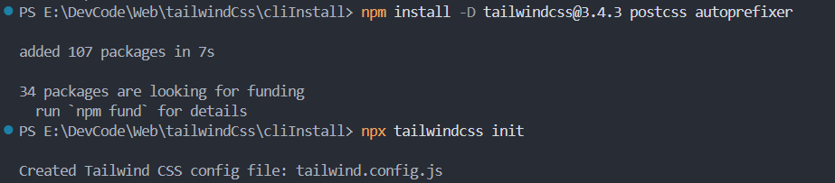

### 配置模板文件的路径

在 `tailwind.config.js` 配置文件中添加所有模板文件的路径。

```javascript
/** @type {import('tailwindcss').Config} */
module.exports = {
  content: ["./src/**/*.{html,js,vue}"],
  theme: {
    extend: {},
  },
  plugins: [],
};
```

### 将加载 Tailwind 的指令添加到你的 CSS 文件中

在你的主 CSS 文件中通过 `@tailwind` 指令添加每一个 Tailwind 功能模块。（src/css_source/input.css）

```css
@tailwind base;
@tailwind components;
@tailwind utilities;
```

### 开启 Tailwind CLI 构建流程

运行命令行（CLI）工具扫描模板文件中的所有出现的 CSS 类（class）并编译 CSS 代码。右边会生成一个dist文件夹，里面的styles.css就是编译的css代码。

```bash
npx tailwindcss -i ./src/css_source/input.css -o ./src/dist/styles.css --watch
```

在 `<head>` 标签内引入编译好的 CSS 文件，然后就可以开始使用 Tailwind 的工具类 来为你的内容设置样式了。

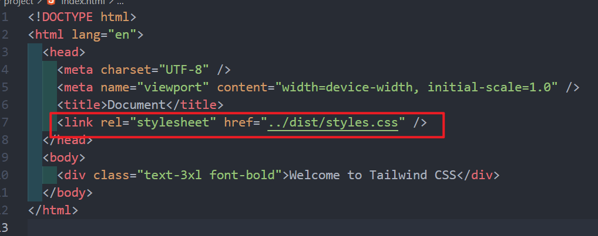

## 常用的css

### FontSize字体大小

```vue
<!-- FONTSIZE - text-xs -->
<!-- xs, sm,base, lg, xl, 2xl-9xl -->
<div class="text-xs">xs -Lorem ipsum dolor sit.</div>
<div class="text-sm">sm -Lorem ipsum dolor sit.</div>
<div class="text-base">base -Lorem ipsum dolor sit.</div>
<div class="text-lg">lg -Lorem ipsum dolor sit.</div>
<div class="text-xl">xl -Lorem ipsum dolor sit.</div>
<div class="text-2xl">2xl -Lorem ipsum dolor sit.</div>
<div class="text-3xl">3xl -Lorem ipsum dolor sit.</div>
<div class="text-4xl">4xl -Lorem ipsum dolor sit.</div>
<div class="text-5xl">5xl -Lorem ipsum dolor sit.</div>
<div class="text-5xl">5xl -Lorem ipsum dolor sit.</div>
<div class="text-7xl">7xl -Lorem ipsum dolor sit.</div>
<div class="text-8xl">8xl -Lorem ipsum dolor sit.</div>
<div class="text-9xl">9xl -Lorem ipsum dolor sit.</div>
```

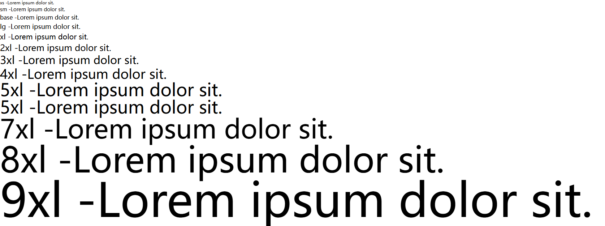

### FontFamily字体

```vue
<!-- FONTFAMILY  (font-*)-->
<!-- sans,serif,mono -->
<div class="font-sans">
  Lorem ipsum, dolor sit amet consectetur adipisicing elit. Deleniti,
  dignissimos?
</div>
<hr />
<div class="font-serif">
  Lorem ipsum, dolor sit amet consectetur adipisicing elit. Deleniti,
  dignissimos?
</div>
<hr />
<div class="font-mono">
  Lorem ipsum, dolor sit amet consectetur adipisicing elit. Deleniti,
  dignissimos?
</div>
```

如果想引用外部字体则需在src/css_source/input.css文件下导入

```css
@import url("https://fonts.googleapis.com/css2?family=Pacifico&display=swap");
```

然后去配置文件中添加字体即可

```javascript
/** @type {import('tailwindcss').Config} */
module.exports = {
  content: ["./src/**/*.{html,js}"],
  theme: {
    extend: {
      fontFamily: {
        paci: ["Pacifico"],
      },
    },
  },
  plugins: [],
};
```

```vue
<div class="font-paci">
	Lorem ipsum, dolor sit amet consectetur adipisicing elit. Deleniti,
    dignissimos?
</div>
```

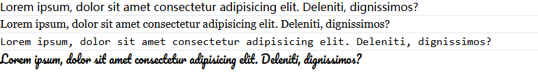

### Text Alignment对齐方式

```vue
<!-- Text Alignment  (text-*)-->
<!--  left, center, right, justify, start, end-->
<div class="text-xl text-left">
  Lorem ipsum dolor sit, amet consectetur adipisicing elit. Consequuntur
  amet dolore molestias tempore placeat ratione sapiente rerum hic suscipit
  in!
</div>
<br />
<div class="text-xl text-right">
  Lorem ipsum dolor sit, amet consectetur adipisicing elit. Consequuntur
  amet dolore molestias tempore placeat ratione sapiente rerum hic suscipit
  in!
</div>
<br />
<div class="text-xl text-justify">
  Lorem ipsum dolor sit, amet consectetur adipisicing elit. Consequuntur
  amet dolore molestias tempore placeat ratione sapiente rerum hic suscipit
  in!
</div>
<br />
<div class="text-xl text-start">
  Lorem ipsum dolor sit, amet consectetur adipisicing elit. Consequuntur
  amet dolore molestias tempore placeat ratione sapiente rerum hic suscipit
  in!
</div>
<br />
<div class="text-xl text-end">
  Lorem ipsum dolor sit, amet consectetur adipisicing elit. Consequuntur
  amet dolore molestias tempore placeat ratione sapiente rerum hic suscipit
  in!
</div>
<br />
```

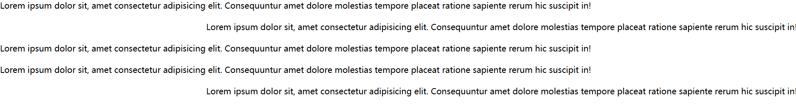

### Text Transform文本转换

```vue
<!-- TEXT TRANSFORM -->
<!-- normal-case, uppercase, lowercase, capitalize -->
<div class="normal-case">Lorem ipsum dolor sit amet.</div>
<div class="uppercase">Lorem ipsum dolor sit amet.</div>
<div class="lowercase">Lorem ipsum dolor sit amet.</div>
<div class="capitalize">Lorem ipsum dolor sit amet.</div>
```

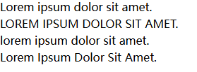

### FontWeight字体粗细

```vue
<!-- font-bold -->
<div class="font-bold">Lorem ipsum dolor sit amet.</div>
<div class="font-medium">Lorem ipsum dolor sit amet.</div>
```

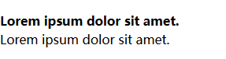

### FontStyle字体样式

```vue
<!-- italics -->
<div class="italic">Lorem ipsum dolor sit amet.</div>
<div class="italic font-bold text-2xl">Lorem ipsum dolor sit amet.</div>
```

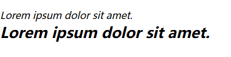

### Text Decoration文本装饰

```vue
<!--underline, overline, line-through-->
<div class="text-xl underline">Lorem, ipsum dolor.</div>
<div class="text-xl line-through">Lorem, ipsum dolor.</div>
<div class="text-xl overline">Lorem, ipsum dolor.</div>
<br />

<!-- Decoration Style -->
<!--  solid, double, dotted, dashed. wavy -->
<div class="text-2xl underline decoration-double">Lorem, ipsum dolor.</div>
<div class="text-2xl underline decoration-dotted">Lorem, ipsum dolor.</div>
<br />
<!-- Decoration Thickness-->
<!--  auto/ from-font/[0,1,2,4,8] -->
<div class="text-2xl underline decoration-4 decoration-blue-400">
   Lorem, ipsum dolor.
</div>
```

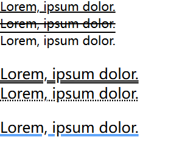

### 边框

```vue
<!-- Line Width -->
<!-- border|outline|ring|divide-[black,white,<color>]-[50-950] -->

<!-- Border Color -->
<div class="text-2xl border-4 border-red-500 mb-5">
  Lorem ipsum dolor sit amet.
</div>
<!-- outline Color -->
<div class="text-2xl outline outline-blue-500 mb-5">
  Lorem ipsum dolor sit amet.
</div>
<!-- ring Color -->
<div class="text-2xl ring ring-blue-500">Lorem ipsum dolor sit amet.</div>
<br />
<!-- divide Color -->
<div class="divide-y-8 divide-orange-500">
  <li>item 1</li>
  <li>item 2</li>
  <li>item 3</li>
</div>
<br />

<!-- Line Style -->
<!--border|outline|ring|divide-[solid,dashed,dotted,double,none,
hidden]-->
<div class="text-2xl m-3 border-4 border-red-500 border-double">
  Lorem ipsum dolor sit amet.
</div>
<div class="text-2xl m-3 outline-dotted outline-4 outline-red-500">
  Lorem ipsum dolor sit amet.
</div>
<div class="divide-y-8 divide-dashed divide-orange-500">
  <li>item 1</li>
  <li>item 2</li>
  <li>item 3</li>
</div>
<br />
```

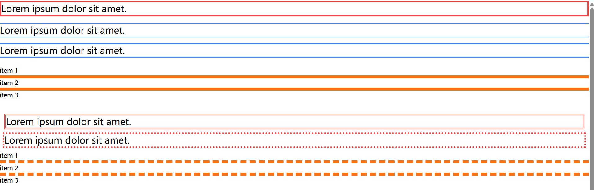

### 颜色

```vue
<!--COLOR-->
<!--Typograhpy (Text, Text Decoration), Background (Background, Gradient),Border(Border, Offset, Ring, Outline, Divide)
Effect (Box Shadow), Interactivity (Caret, Accent Color), SVG(Stroke, Fill) -->

<!--COLORS: 
      slate, gray,zinc,neutral,stone
      red,orange,amber,yellow,green
      lime,green,emerald,teal
      cyan,sky,blue,indigo,viole,purple,
      fuchsia,pink,rose
    -->
<!-- 50 -950 -->
<div class="text-3xl font-bold underline">Color</div>

<div class="text-2xl text-emerald-800">Lorem ipsum dolor sit amet.</div>
<div class="text-2xl text-yellow-500">Yellow is what we want to see</div>

<br />
<!-- Background-->
<div class="text-2xl bg-blue-400">Lorem ipsum dolor sit amet.</div>
<div class="text-2xl bg-rose-400">Lorem ipsum dolor sit amet.</div>
<div class="text-2xl bg-amber-400">Lorem ipsum dolor sit amet.</div>
<div class="text-2xl bg-amber-800 text-blue-50">
  Lorem ipsum dolor sit amet.
</div>
<div class="text-2xl bg-blue-600 text-white">Lorem ipsum dolor sit.</div>
<div class="text-2xl bg-blue-100 text-black">
  Lorem ipsum dolor sit amet.
</div>
<br />

<div class="text-3xl bg-indigo-500/50">Lorem ipsum dolor sit amet.</div>
<div class="text-3xl bg-indigo-500">Lorem ipsum dolor sit amet.</div>
<div class="text-3xl text-[#1a6b3e] bg-[#f7b536]">
  Lorem ipsum dolor sit amet.
</div>
```

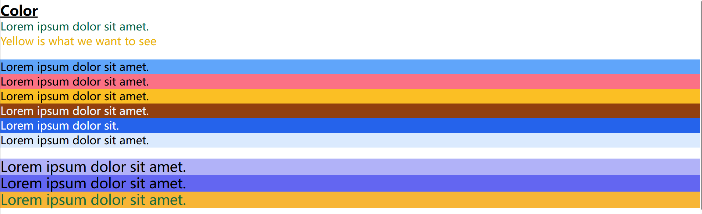

### Border,outline和ring的区别

```vue
<!-- Different Between Border,outline,and Ring -->
<!-- Border是一个标准CSS属性，用于样式和布局的目的，他直接应用于元素
    Outline主要用于辅助功能,目的是指示焦点或选择状态.他也直接应用于元素本身
    Ring是一个特定的实用程序类,他在周围创建一个类似于环形的外观元素,它通常用于视觉反馈或突出显示,他是在外部渲染的,元素边界允许附加选项 -->
<div
  class="text-2xl m-4 p-3 border-4 border-red-500 outline outline-4 outline-green-300 outline-offset-2 ring-4 ring-blue-700 ring-offset-8 ring-offset-yellow-500"
>
  Different Between Border,outline,and Ring
</div>
```

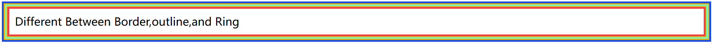

### 配置文件

官网给出的字体大小最高为9xl，如果我们写text-10xl就不会生效，因为10xl不存在。想要用10xl就需要我们去配置文件里自定义一下。

```vue
<div class="text-10xl">Welcome</div>

/*tailwind.config.js*/ theme: { extend: { fontSize: { "10xl": "10rem", }, }, },
```

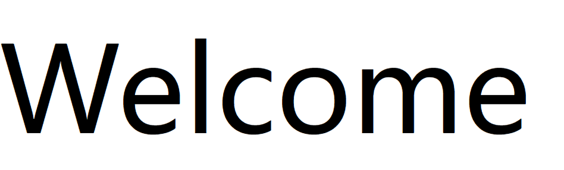

如果你想覆盖全局的文本字体大小，你可以将配置写在extend外面，这样的话只有你配置的字体大小，其他的xl-8xl将不生效了，即：

```vue
<div class="text-9xl">Welcome</div>
<div class="text-10xl">Welcome</div>
<div class="text-4xl">Welcome</div>

/** @type {import('tailwindcss').Config} */ module.exports = { content:
["./src/**/*.{html,js}"], theme: { fontSize: { "9xl": "8rem", "10xl": "10rem",
}, extend: {}, }, plugins: [], };
```

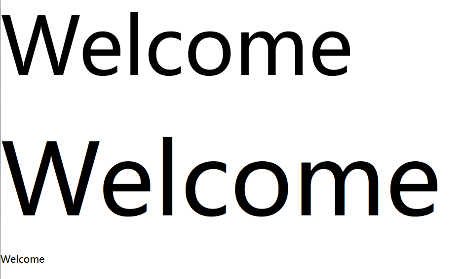

如果你想配置你的主题色和次要的一些颜色，同样也可以在extend里面设置。

```javascript
/** @type {import('tailwindcss').Config} */
module.exports = {
  content: ["./src/**/*.{html,js}"],
  theme: {
    extend: {
      fontSize: {
        "10xl": "10rem",
      },
      colors: {
        primary: "#b83975",
        secondary: {
          100: "#aeff83",
          400: "#abdcc68",
          600: "#8e994e",
          800: "#5f6634",
          900: "#2f331a",
          950: "#181a0d",
        },
      },
    },
  },
  plugins: [],
};
```

通过简单配置的颜色，你还可以添加其他一些类如下划线颜色，背景色等。您还可以使用自定义十六进制小数颜色。

```vue
<div class="text-9xl text-secondary-800 underline decoration-primary">
  Welcome
</div>
<div class="text-10xl text-primary bg-secondary-100">Welcome</div>
<div class="text-2xl bg-[#2cc5e4]">Welcome</div>
```


### 边框和边距

边框（border）：

```vue
<div class="text-3xl font-bold underline">Borders :<span class="text-lg">(border, outline,ring, divide)</div>
<br>
<!--border-[x,y,s,e,t,b,l,r]-[0,1,2,4,8,] -->
<div class="text-3xl border-8 ">Lorem ipsum dolor sit amet consectetur adipisicing elit. </div>
<br>
<div class="text-2xl outline ">Lorem ipsum dolor sit amet.</div>
<!--Border types = [border, outline, ring, divide], Effects=[width,style,color]-->

<!-- Line Width -->
<!-- border|outline|ring|divide-[x,y,s,e,t,b,l,r]- [0,1,2,4,8,] -->
<div class="text-2xl border-4 m-4 p-3">Border- Lorem ipsum dolor sit amet.</div>
<div class="text-2xl outline outline-4 m-4 p-3">Outline- Lorem ipsum dolor sit amet.</div>
<div class="text-2xl ring-4 m-4 p-3">Ring- Lorem ipsum dolor sit amet.</div>

<!-- Divide -->
<ul class="divide-y-8">
  <li>item 1</li>
  <li>item 2</li>
  <li>item 3</li>
  <li>item 4</li>
</ul>

<p class="divide-x-4">
  <span class="ml-5 pl-5">item 1</span>
  <span class="ml-5 pl-5">item 2</span>
  <span class="ml-5 pl-5">item 3</span>
  <span class="ml-5 pl-5">item 4</span>
</p>
```

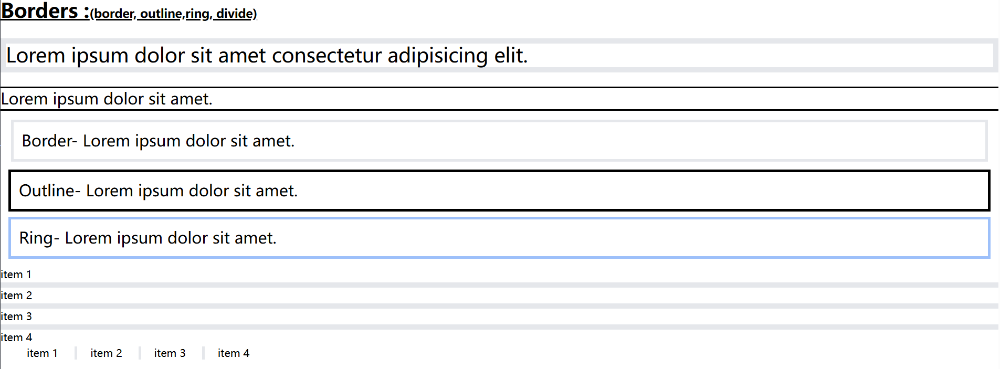

内外边距（padding，margin）：

```vue
<!--  p|m-[x,y,t,r,l,b,s,e|px]-[0.5-3,4-96] -->
<div class="text-3xl font-bold underline">Padding:</div>
<div class="text-3xl border-4 pr-4">Lorem ipsum dolor sit amet.</div>
<div class="text-3xl border-4 p-px">Lorem ipsum dolor sit amet.</div>
<br />
<div class="text-3xl font-bold underline">Margin:</div>
<div class="text-3xl border-4 mb-3">Lorem ipsum dolor sit amet.</div>
<div class="text-3xl border-4 m-2">Lorem ipsum dolor sit amet.</div>
<div class="text-3xl border-4 m-px">Lorem ipsum dolor sit amet.</div>
```

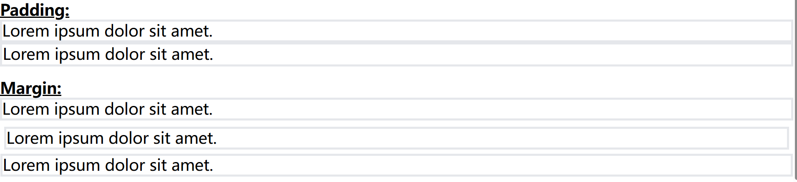

### 边框圆角

```
<!--Rounded Edges -  (border|outline|ring)-->
<!--rounded-[s,e,t,r,l,b,ss,se,ee,es,tl,tr,br,bl]-[none,sm,md,lg,xl,2xl,3xl, full]-->
<div class="text-lg m-5 p-3 border-4 border-green-500 rounded-full">Lorem ipsum, dolor sit amet consectetur adipisicing elit. Deleniti laudantium aspernatur pariatur veritatis veniam.</div>
<span class="m-3 p-4 border-4   rounded-full">Lorem.</span>
<div class="m-3 p-4 border-4 border-green-400 mt-10 rounded-br-2xl rounded-tl-2xl ">Lorem ipsum dolor sit amet!</div>
```

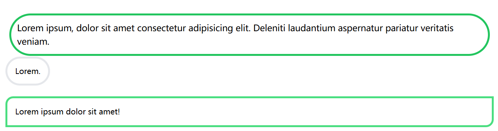
